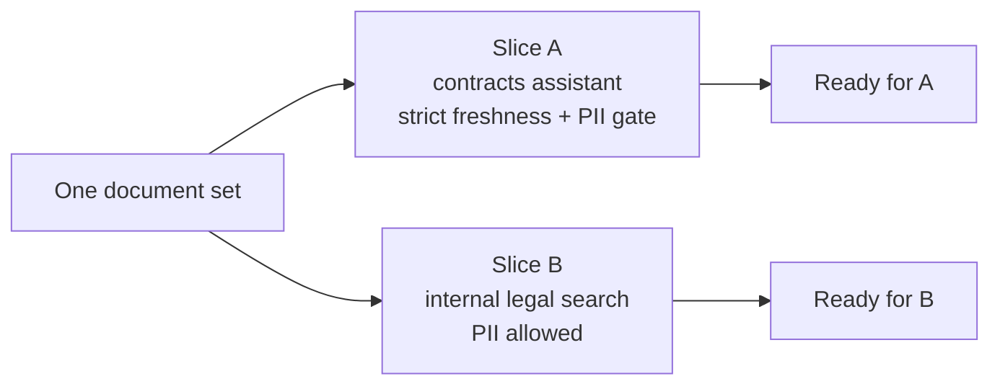

AI readiness is the question every use case has to answer before documents reach an agent, a RAG pipeline, or a lakehouse: is this data trustworthy, current, unique, and relevant enough to build on? Deasy Labs turns that question into measurable, file-level signals and a curated slice that enforces them.

## The Dimensions

| Dimension | Question | Signal |
| :-- | :-- | :-- |
| **Metadata coverage** | Do we know what each document is? | The standard quality tags (`Title`, `Author`, `Document Type`, `Document Date`) are present |
| **Freshness** | Is the content still current? | Share of files not tagged `expired` |
| **Uniqueness** | Is each document the single, latest copy? | Duplicates and superseded versions tagged `redundant` |
| **Relevance** | Does the document belong to this use case? | Positive selection on extracted tags |
| **Sensitivity** (opt-in) | Is the content safe for this audience? | `PII` / `PCI` / `PHI` rollup tags |

The readiness score is a summary; the products are the file-level signals and the filtered slice. Unrun dimensions are excluded from the score, not counted as zero.

## The Data Quality Status Tag

Quality verdicts share one flag: `Data Quality Status`. A document tagged with it is either `redundant` (a duplicate or superseded copy, written by the platform's duplicate detection), `expired` (out of date for the use case's freshness rule), or otherwise flagged as unfit, such as `irrelevant`. A document with no `Data Quality Status` tag has passed every quality check, which is why the AI-ready slice uses a single `not_exists` condition.

Files are tagged and excluded, never deleted, so every decision is auditable and reversible.

## Readiness Is Per Use Case

A slice is a use case. Readiness scopes to a slice and applies that use case's own rules: which quality dimensions matter, what the freshness cutoff is, which document types are relevant, and whether sensitivity is part of the gate. The same file can be ready for one slice and not another.

## Where It Runs

- **In the app**, the Data Quality screen walks the flow: Summary, Uniqueness, Freshness, Metadata, and AI Ready Data, with review steps for duplicates and expiring files. Background jobs appear in the Command Center.
- **Through the SDK**, the whole flow is triggerable programmatically: run the scan, write the signals, and produce the curated slice inside your own pipeline. [Prepare an AI-Ready Dataset](/cookbooks/data-quality) is the complete headless walkthrough, ordered so the expensive classification step only ever runs on documents that survive the free filters.

## Next Steps

<CardGroup cols={2}>
  <Card title="Prepare an AI-Ready Dataset" icon="filter" href="/cookbooks/data-quality">
    The full readiness flow through the SDK.
  </Card>
  <Card title="Keep Answers Current Over Time" icon="clock" href="/cookbooks/freshness-curation">
    The freshness dimension in depth.
  </Card>
  <Card title="Protect Sensitive Data" icon="shield" href="/cookbooks/pii-detection">
    The opt-in sensitivity gate.
  </Card>
  <Card title="Data Slices" icon="layer-group" href="/concepts/data-slices">
    The slice conditions that enforce readiness.
  </Card>
</CardGroup>
