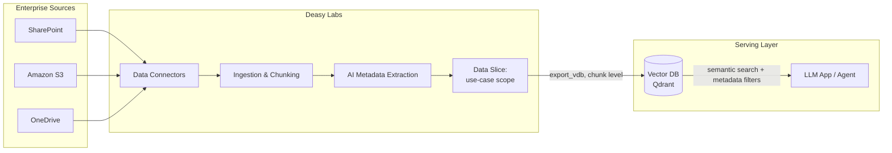
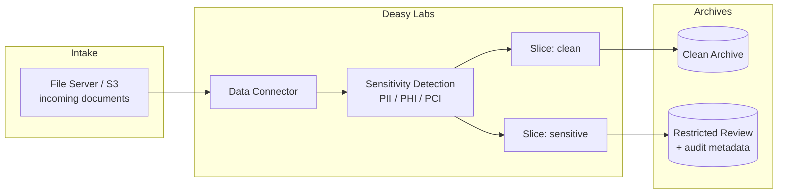
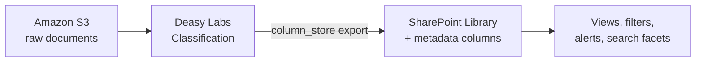

These blueprints show how the platform's building blocks compose into production systems. Each pattern links to a cookbook with a complete, runnable script.

## Enterprise RAG Pattern

Feed a retrieval-augmented generation application with curated, metadata-rich chunks instead of raw document dumps. Metadata filters cut retrieval noise so the LLM only sees chunks from the right documents.

**Key decisions in this pattern:**

| Decision | Recommendation |
| :-- | :-- |
| Export level | `chunk`, one vector record per text segment |
| Scoping | Create one Data Slice per use case; export the slice, not the whole connector |
| Metadata | Extract classification tags (document type, department, date) to power retrieval filters |
| Freshness | Re-run classification on a "needs-processing" slice, then re-export |

<Card title="Clean Up a RAG Index" icon="database" href="/cookbooks/qdrant-to-qdrant">
  Complete script: connector → tags → classification → slice → vector export.
</Card>

## Compliance Archive Pattern

Automatically detect sensitive content and route documents to the right archive. Clean documents flow to general storage, flagged documents go to a restricted review bucket with a full metadata audit trail.

**Key decisions in this pattern:**

| Decision | Recommendation |
| :-- | :-- |
| Detection | Combine built-in sensitivity tags with regex Pattern tags for exact matches |
| Routing | Two Data Slices driven by `has_pii` / risk-score metadata conditions |
| Audit | Export with `metadata_format="column_store"` so auditors can query flags directly |
| Scope | Enable PII/PHI/PCI scanning per [Project](/concepts/projects) |

<Card title="Protect Sensitive Data" icon="shield" href="/cookbooks/pii-detection">
  Complete script: sensitivity tags → classification → routing slices → dual export.
</Card>

## Document Enrichment Pattern

Keep documents where they live and enrich them at the source. Extracted metadata lands as native SharePoint columns, so users get filterable, sortable libraries without changing how they work.

<Card title="Organize a SharePoint Library" icon="microsoft" href="/cookbooks/sharepoint-to-sharepoint">
  Complete script: connector → tags → classification → column-store export.
</Card>
