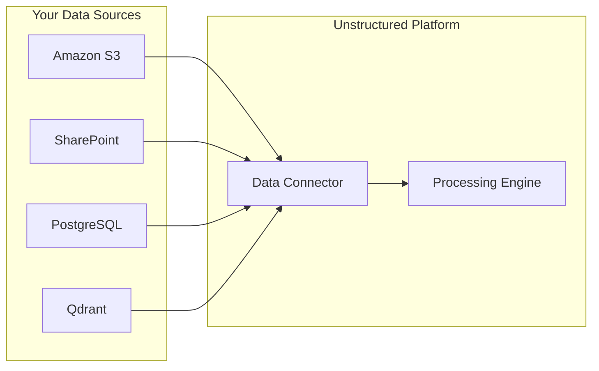

Data Connectors establish secure connections between the platform and your document storage. Once connected, the platform can discover documents, read content for metadata extraction, and write enriched metadata back to the source.

## Supported Data Connectors

<CardGroup cols={2}>
  <Card title="Amazon S3" icon="aws">
    Connect to AWS S3 buckets for scalable cloud storage.
  </Card>
  <Card title="SharePoint" icon="microsoft">
    Integrate with Microsoft 365 document libraries.
  </Card>
  <Card title="PostgreSQL" icon="database">
    Connect to PostgreSQL databases with pgvector support.
  </Card>
  <Card title="Qdrant" icon="bullseye">
    Vector database integration for semantic search.
  </Card>
</CardGroup>

### Configuration Details

| Source Type | Description | Key Configuration | Ideal Use Case |
| :-- | :-- | :-- | :-- |
| **Amazon S3** | AWS cloud object storage | Bucket name, Access Key, Secret Key | Large-scale document archives, cloud-native workflows |
| **SharePoint** | Microsoft 365 document management | Client ID, Client Secret, Tenant ID, Site Name | Enterprise document libraries, Office 365 environments |
| **PostgreSQL** | Relational database with pgvector extension | Host URL, Database name, User credentials, Port | Structured + unstructured hybrid data, existing database workflows |
| **Qdrant** | Purpose-built vector database for AI | API Key, Collection name, URL | Semantic search applications, RAG pipelines |

## Key Features

<CardGroup cols={2}>
  <Card title="Multiple Profiles" icon="layer-group">
    Create and manage multiple Data Connector connections
  </Card>
  <Card title="Connection Testing" icon="vial">
    Validate credentials before saving
  </Card>
  <Card title="Active Profile Selection" icon="toggle-on">
    Switch between Data Connectors with one click
  </Card>
  <Card title="Schema Configuration" icon="table-columns">
    Customize field mappings (filename key, text key, tags key)
  </Card>
</CardGroup>

## How Data Connectors Work

<Steps>
  <Step title="Create a Connector">
    Select your storage type and provide the required credentials.
  </Step>
  <Step title="Test the Connection">
    Validate that the platform can access your documents before saving.
  </Step>
  <Step title="Configure Schema Mapping">
    Map your data fields (filename, text content, tags) to the platform's expected format.
  </Step>
  <Step title="Start Processing">
    Your documents are now available for metadata extraction.
  </Step>
</Steps>

---

## API Reference

<CardGroup cols={2}>
  <Card title="Create Connector" icon="plus" href="/api-reference/data-connectors/create">
    Create a new data connector
  </Card>
  <Card title="Update Connector" icon="pen" href="/api-reference/data-connectors/update">
    Update an existing connector configuration
  </Card>
  <Card title="List Connectors" icon="list" href="/api-reference/data-connectors/list">
    List all your data connectors
  </Card>
  <Card title="Delete Connector" icon="trash" href="/api-reference/data-connectors/delete">
    Remove a data connector
  </Card>
  <Card title="Ingest Data" icon="upload" href="/api-reference/data-connectors/ingest">
    Ingest documents from a connector
  </Card>
  <Card title="List Ingested Data" icon="database" href="/api-reference/data-connectors/list-ingested-data">
    View ingested document metadata
  </Card>
</CardGroup>
