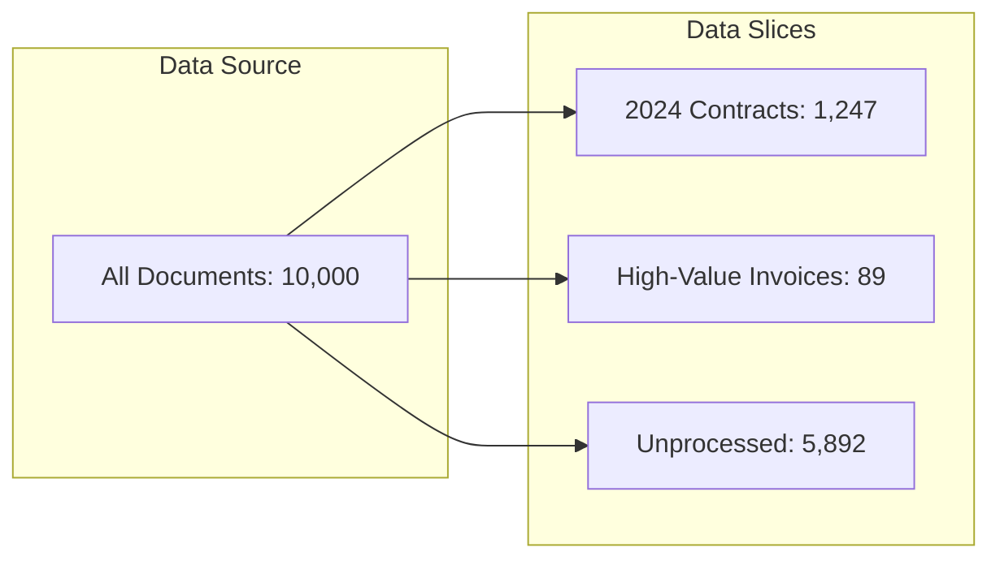

Data Slices are filtered subsets of your data based on metadata. They allow you to focus on specific segments of your document repository without affecting the entire dataset.

## Benefits

| Benefit | Description |
| :-- | :-- |
| **Targeted Processing** | Run extraction on only relevant documents (e.g., just 2024 contracts) |
| **Focused Analysis** | View and analyze specific document categories |
| **Efficient Workflows** | Avoid reprocessing already-enriched documents |
| **Team Collaboration** | Share team-specific data slices with team members |
| **Controllability** | Run downstream applications on controlled data |

## Data Slice Properties

| Property | Description |
| :-- | :-- |
| **Name** | User-defined identifier |
| **Description** | Optional notes about what's included |
| **Data Connector** | Which Data Connector it's derived from |
| **Document Count** | Number of files matching the conditions |
| **Conditions** | Filter rules that define the slice based on metadata |

## How Data Slices Work



## Example Data Slices

| Slice Name | Filter Conditions | Document Count |
| :-- | :-- | :-- |
| "2024 Contracts" | Document Type = Contract AND Year = 2024 | 1,247 |
| "High-Value Invoices" | Invoice Amount > $10,000 | 89 |
| "Documents with PII" | SSN_Detected = Yes OR Email_Detected = Yes | 3,521 |
| "Unprocessed Files" | Document Type = null | 5,892 |

<Tip>
Use Data Slices to create focused workflows. For example, process only untagged documents to avoid reprocessing, or create a slice of high-priority documents for immediate attention.
</Tip>

## Creating Effective Data Slices

<Steps>
  <Step title="Define Your Goal">
    Identify what subset of documents you need to work with.
  </Step>
  <Step title="Choose Filter Conditions">
    Select metadata fields and values that define your target documents.
  </Step>
  <Step title="Combine Conditions">
    Use AND/OR logic to create precise filters.
  </Step>
  <Step title="Verify Document Count">
    Check that the slice captures the expected number of documents.
  </Step>
  <Step title="Apply to Workflows">
    Use the slice in Projects or for targeted exports.
  </Step>
</Steps>

## Common Use Cases

<CardGroup cols={2}>
  <Card title="Incremental Processing" icon="forward">
    Filter to documents that haven't been processed yet
  </Card>
  <Card title="Compliance Review" icon="shield-check">
    Focus on documents containing sensitive information
  </Card>
  <Card title="Time-Based Analysis" icon="calendar">
    Analyze documents from specific time periods
  </Card>
  <Card title="Category Deep-Dive" icon="folder-tree">
    Examine all documents of a particular type
  </Card>
</CardGroup>

---

## Python SDK

<Tabs>
  <Tab title="Create Data Slice">
```python
from unstructured import UnstructuredClient

client = UnstructuredClient(
    username="your-username",
    password="your-password",
)

# Create a data slice with filter conditions
slice = client.dataslice.create(
    dataslice_name="2024-contracts",
    connector_name="my-s3-bucket",
    conditions=[
        {"field": "document_type", "operator": "eq", "value": "Contract"},
        {"field": "year", "operator": "eq", "value": 2024},
    ],
)
print(f"Created slice with {slice.document_count} documents")
```
  </Tab>
  <Tab title="Filter Examples">
```python
# Filter by metadata values
high_value = client.dataslice.create(
    dataslice_name="high-value-contracts",
    connector_name="my-s3-bucket",
    conditions=[
        {"field": "contract_value", "operator": "gte", "value": 100000},
    ],
)

# Filter unprocessed documents
unprocessed = client.dataslice.create(
    dataslice_name="needs-processing",
    connector_name="my-s3-bucket",
    conditions=[
        {"field": "document_type", "operator": "is_null", "value": True},
    ],
)

# Filter documents with PII
sensitive = client.dataslice.create(
    dataslice_name="contains-pii",
    connector_name="my-s3-bucket",
    conditions=[
        {"field": "has_ssn", "operator": "eq", "value": True},
    ],
)
```
  </Tab>
  <Tab title="Export Slice">
```python
# Export a data slice to a destination
result = client.dataslice.export_metadata(
    dataslice_name="2024-contracts",
    export_format="csv",
)
print(f"Exported to: {result.file_path}")

# Export to a vector database
client.destination.export(
    destination_name="my-qdrant",
    dataslice_name="2024-contracts",
    export_level="chunk",
    export_nodes=True,
)
```
  </Tab>
  <Tab title="List & Delete">
```python
# List all data slices
slices = client.dataslice.list()
for s in slices.dataslices:
    print(f"{s.dataslice_name}: {s.document_count} docs")

# Delete a data slice
client.dataslice.delete(dataslice_name="old-slice")
print("Data slice deleted")
```
  </Tab>
</Tabs>

---

## API Reference

<CardGroup cols={2}>
  <Card title="Create Data Slice" icon="plus" href="/api-reference/data-slices/create">
    Create a new data slice
  </Card>
  <Card title="List Data Slices" icon="list" href="/api-reference/data-slices/list">
    List all your data slices
  </Card>
  <Card title="Delete Data Slice" icon="trash" href="/api-reference/data-slices/delete">
    Remove a data slice
  </Card>
  <Card title="Export Data Slice" icon="download" href="/api-reference/data-slices/export">
    Export data from a slice
  </Card>
</CardGroup>
