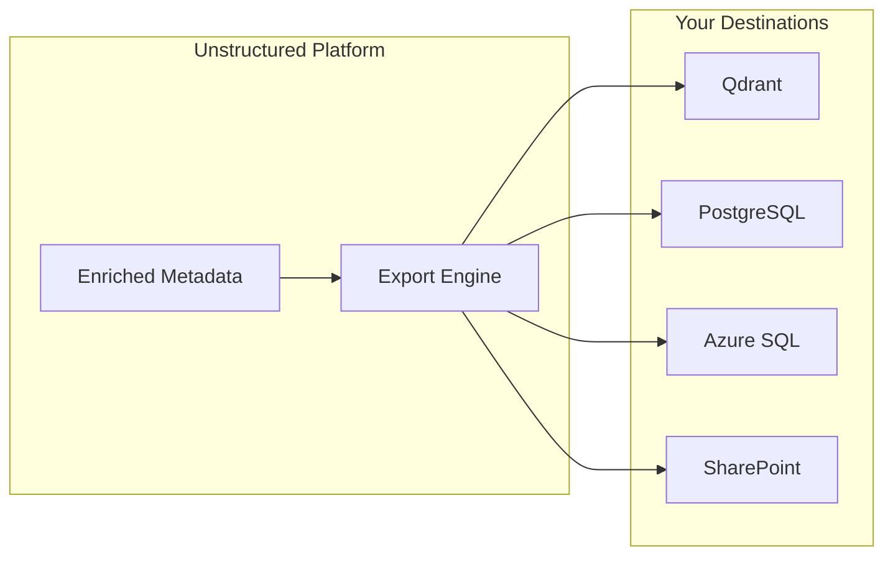

Destinations are target systems where enriched metadata and document data can be exported. While Data Connectors bring documents into the platform, Destinations push enriched data out to vector databases, document management systems, and databases for downstream applications.

## Supported Destinations

<CardGroup cols={2}>
  <Card title="Qdrant" icon="bullseye">
    Vector database for AI applications and semantic search.
  </Card>
  <Card title="PostgreSQL" icon="database">
    Relational database with vector support for hybrid search.
  </Card>
  <Card title="Azure SQL" icon="microsoft">
    Enterprise-grade SQL database in the Azure cloud.
  </Card>
  <Card title="SharePoint" icon="microsoft">
    Enrich original documents with metadata columns in Microsoft 365.
  </Card>
</CardGroup>

### Configuration Details

| Destination Type | Description | Key Configuration | Ideal Use Case |
| :-- | :-- | :-- | :-- |
| **Qdrant** | Vector database for AI applications | Collection name, URL, API Key | Semantic search, RAG pipelines |
| **PostgreSQL** | Relational database with vector support | Host, Database, Collection, Credentials | Structured analytics, hybrid search |
| **Azure SQL** | Microsoft cloud database | Server, Database, Table, Credentials | Enterprise data warehouses |
| **SharePoint** | Microsoft 365 document management | Client ID/Secret, Tenant ID, Site Name | Enriching original documents with metadata columns |

## Export Options

| Option | Description | Values |
| :-- | :-- | :-- |
| **Export Level** | What data granularity to export | `file` (document-level), `chunk` (segment-level), `both` |
| **Export Tags** | Specific metadata tags to include | List of tag names, or empty for all |
| **Export Nodes** | Include vector embeddings | `true` / `false` |
| **Export Metadata** | Include extracted metadata | `true` / `false` |
| **Metadata Format** | How metadata is stored | `column_store` (separate columns), `json_store` (single JSON column) |

<Note>
**Export Processing:**
- **Small Exports** (&lt; 100 files): Processed synchronously with immediate results
- **Large Exports** (≥ 100 files): Processed in the background with progress tracking via `tracker_id`
</Note>

## How Destinations Work

<Steps>
  <Step title="Create a Destination">
    Configure the target system with the required credentials.
  </Step>
  <Step title="Select Export Options">
    Choose what data to export (file-level, chunk-level, specific tags).
  </Step>
  <Step title="Choose Metadata Format">
    Decide between column store (separate columns) or JSON store (single JSON column).
  </Step>
  <Step title="Run Export">
    The platform sends enriched data to your destination system.
  </Step>
</Steps>

---

## API Reference

<CardGroup cols={2}>
  <Card title="Create Destination" icon="plus" href="/api-reference/destinations/create">
    Create a new destination
  </Card>
  <Card title="List Destinations" icon="list" href="/api-reference/destinations/list">
    List all your destinations
  </Card>
  <Card title="Delete Destination" icon="trash" href="/api-reference/destinations/delete">
    Remove a destination
  </Card>
  <Card title="Export to Destination" icon="upload" href="/api-reference/destinations/export">
    Export enriched data to a destination
  </Card>
</CardGroup>
