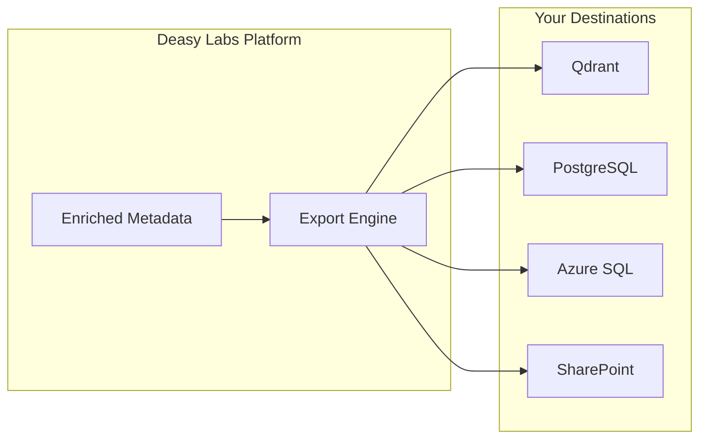

Destinations are target systems where enriched metadata and document data can be exported. While Data Connectors bring documents into the platform, Destinations push enriched data out to vector databases, document management systems, and databases for downstream applications.

## Supported Destinations

<CardGroup cols={2}>
  <Card title="PostgreSQL" icon="database">
    Relational database with vector support for hybrid search.
  </Card>
  <Card title="Azure SQL" icon="microsoft">
    Enterprise-grade SQL database in the Azure cloud.
  </Card>
  <Card title="SharePoint" icon="microsoft">
    Enrich original documents with metadata columns in Microsoft 365.
  </Card>
  <Card title="OneDrive" icon="cloud">
    Push enriched documents and metadata to OneDrive libraries.
  </Card>
  <Card title="Amazon S3" icon="aws">
    Write enriched output to S3 buckets.
  </Card>
  <Card title="Google Cloud Storage" icon="google">
    Write enriched output to GCS buckets.
  </Card>
  <Card title="Qdrant" icon="bullseye">
    Serve curated chunks to RAG pipelines via slice export.
  </Card>
</CardGroup>

### Configuration Details

| Destination Type | Description | Key Configuration | Ideal Use Case |
| :-- | :-- | :-- | :-- |
| **PostgreSQL** | Relational database with vector support | Host URL, Port, Database, Collection, Credentials | Structured analytics, hybrid search |
| **Azure SQL** | Microsoft cloud database | Server, Database, Table, Credentials | Enterprise data warehouses |
| **SharePoint** | Microsoft 365 document management | Client ID/Secret, Tenant ID, Site Name | Enriching original documents with metadata columns |
| **OneDrive** | Microsoft OneDrive cloud storage | Client ID/Secret, Tenant ID, Site, Library folder | Team drives in Microsoft 365 |
| **Amazon S3** | AWS cloud object storage | Bucket name, Access Key, Secret Key | Cloud-native archives and pipelines |
| **Google Cloud Storage** | GCP cloud object storage | Bucket, Service Account | GCP-native archives and pipelines |
| **Qdrant** | Vector database | URL, API Key, Collection | RAG serving collections |

See the [Integrations Overview](/integrations/overview) for the complete matrix of sources, destinations, and supported file types.

<Tip>
To export a data slice into a **vector database** (e.g. Qdrant) for RAG pipelines, use `client.data_slice.export_vdb(...)`. See [Data Slices](/concepts/data-slices).
</Tip>

## Export Options

| Option | Description | Values |
| :-- | :-- | :-- |
| **Export Level** | What data granularity to export | `file` (document-level), `chunk` (segment-level), `both` |
| **Export Tags** | Specific metadata tags to include | List of tag names, or empty for all |
| **Export Nodes** | Include vector embeddings | `true` / `false` |
| **Export Metadata** | Include extracted metadata | `true` / `false` |
| **Metadata Format** | How metadata is stored | `column_store` (separate columns), `json_store` (single JSON column) |

<Note>
**Export Processing:**
- **Small Exports** (&lt; 100 files): Processed synchronously with immediate results
- **Large Exports** (≥ 100 files): Processed in the background with progress tracking via `tracker_id`
</Note>

## How Destinations Work


```mermaid
flowchart LR
    subgraph platform [Deasy Labs Platform]
        META[Enriched Metadata]
        EXP[Export Engine]
    end
    
    subgraph destinations [Your Destinations]
        QD[Qdrant]
        PG[PostgreSQL]
        AZ[Azure SQL]
        SP[SharePoint]
    end
    
    META --> EXP
    EXP --> QD
    EXP --> PG
    EXP --> AZ
    EXP --> SP
```

<Steps>
  <Step title="Create a Destination">
    Configure the target system with the required credentials.
  </Step>
  <Step title="Select Export Options">
    Choose what data to export (file-level, chunk-level, specific tags).
  </Step>
  <Step title="Choose Metadata Format">
    Decide between column store (separate columns) or JSON store (single JSON column).
  </Step>
  <Step title="Run Export">
    The platform sends enriched data to your destination system.
  </Step>
</Steps>

---

## Python SDK

<Tabs>
  <Tab title="Create Destination">
```python
from unstructured import UnstructuredClient

client = UnstructuredClient(
    base_url="https://unstructured.your-company.com/rest/unstructured",
    username="your-username",
    password="your-password",
)

# Create a PostgreSQL destination
destination = client.destination.create(
    connector_name="my-postgres-destination",
    connector_body={
        "type": "PostgresNodeDestinationManager",
        "name": "my-postgres-destination",
        "url": "your-db-host.example.com",
        "port": 5432,
        "database_name": "analytics",
        "collection_name": "documents",
        "db_user": "postgres",
        "password": "YOUR_DB_PASSWORD",
    },
)
print(f"Created destination: {destination.profile_id}")
```
  </Tab>
  <Tab title="Export Data">
```python
# Export enriched data to a destination
result = client.destination.export(
    destination_name="my-postgres-destination",
    data_connector_name="my-s3-bucket",
    export_level="chunk",       # "file", "chunk", or "both"
    export_metadata=True,       # Include extracted metadata
    metadata_format="json_store",
)
print(f"Exported {result.success} files ({result.failed} failed)")

# For large exports, track progress
if result.tracker_id:
    status = client.task_status.get_status(job_id=result.tracker_id)
    print(f"Export {status.percent_complete:.0f}% complete ({status.status})")
```
  </Tab>
  <Tab title="List Destinations">
```python
# List all destinations (returned as a dict keyed by destination name)
destinations = client.destination.list()
for name, config in destinations.connectors.items():
    print(name)
```
  </Tab>
  <Tab title="Delete Destination">
```python
# Delete a destination
client.destination.delete(connector_name="my-postgres-destination")
print("Destination deleted")
```
  </Tab>
</Tabs>

---

## API Reference

<CardGroup cols={2}>
  <Card title="Create Destination" icon="plus" href="/api-reference/destinations/create">
    Create a new destination
  </Card>
  <Card title="List Destinations" icon="list" href="/api-reference/destinations/list">
    List all your destinations
  </Card>
  <Card title="Delete Destination" icon="trash" href="/api-reference/destinations/delete">
    Remove a destination
  </Card>
  <Card title="Export to Destination" icon="upload" href="/api-reference/destinations/export">
    Export enriched data to a destination
  </Card>
</CardGroup>
