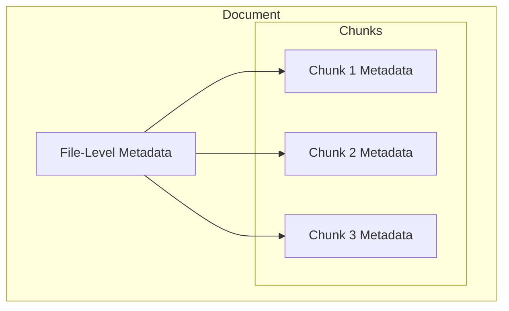

Metadata represents the actual extracted values that result from applying Tags to your documents. While Tags define *what* to extract, Metadata is the *extracted data* itself.

## Metadata Properties

| Property | Description | Example |
| :-- | :-- | :-- |
| **Values** | The extracted or classified value(s) | `["NDA", "Non-Disclosure Agreement"]` |
| **Evidence** | Text snippet supporting the extraction | "This Non-Disclosure Agreement is entered into..." |
| **Confidence** | AI confidence score (0-1) | `0.95` |

<Tip>
The **Evidence** field shows exactly where the AI found the information, making it easy to verify extractions and understand the source.
</Tip>

## Metadata Levels

| Level | Description | Use Case |
| :-- | :-- | :-- |
| **File-Level** | Aggregated metadata for the entire document | Document classification, search filters |
| **Chunk-Level** | Granular metadata per text segment | Precise evidence location, RAG retrieval |



## Metadata Standardization

The platform includes AI-powered standardization to clean and normalize extracted values:

| Feature | Description |
| :-- | :-- |
| **Deduplication** | Merge similar values (e.g., "Inc." and "Incorporated") |
| **Normalization** | Standardize formats (dates, currencies, names) |
| **Bulk Standardization** | Apply standardization across multiple tags |

<Note>
Standardization helps ensure consistency across your metadata, making it easier to search, filter, and analyze your documents.
</Note>

## How Metadata Generation Works

<Steps>
  <Step title="Document Processing">
    Documents are chunked and prepared for analysis.
  </Step>
  <Step title="Tag Application">
    The AI applies your Tags to extract or classify information from each chunk.
  </Step>
  <Step title="Evidence Capture">
    The system captures the text snippet that supports each extraction.
  </Step>
  <Step title="Aggregation">
    Chunk-level metadata is aggregated to create file-level metadata.
  </Step>
  <Step title="Standardization">
    Optional normalization and deduplication cleans the results.
  </Step>
</Steps>

## Example Metadata Output

For a contract document with a "Contract Type" classification tag:

```json
{
  "tag": "Contract Type",
  "values": ["NDA"],
  "evidence": "This Non-Disclosure Agreement ('Agreement') is entered into as of January 1, 2024...",
  "confidence": 0.97
}
```

---

## Python SDK

<Tabs>
  <Tab title="Generate Metadata">
```python
from unstructured import UnstructuredClient

client = UnstructuredClient(
    username="your-username",
    password="your-password",
)

# Generate metadata for a single document
result = client.classify.generate(
    file_path="s3://my-bucket/contract.pdf",
    taxonomy_name="contract-analysis",
)

print(f"Document: {result.file_name}")
for tag, value in result.tags.items():
    print(f"  {tag}: {value}")
```
  </Tab>
  <Tab title="Batch Processing">
```python
# Generate metadata for all documents in a connector
results = client.classify.generate_batch(
    connector_name="my-s3-bucket",
    taxonomy_name="contract-analysis",
)

print(f"Processed {len(results.metadata)} documents")
for doc in results.metadata:
    print(f"\n{doc.file_name}:")
    print(f"  Type: {doc.tags.get('contract_type')}")
    print(f"  Value: ${doc.tags.get('total_value', 0):,.2f}")
```
  </Tab>
  <Tab title="List Metadata">
```python
# List metadata for documents
metadata = client.metadata.list(
    connector_name="my-s3-bucket",
    tag_names=["contract_type", "effective_date"],
)

for doc in metadata.documents:
    print(f"{doc.file_name}: {doc.tags}")

# Paginated listing for large datasets
page = client.metadata.list_paginated(
    connector_name="my-s3-bucket",
    page_size=100,
    page_number=1,
)
print(f"Page 1 of {page.total_pages}")
```
  </Tab>
  <Tab title="Upsert & Delete">
```python
# Manually upsert metadata
client.metadata.upsert(
    file_name="contract.pdf",
    connector_name="my-s3-bucket",
    tags={
        "contract_type": "NDA",
        "reviewed": True,
        "reviewer": "John Doe",
    },
)

# Delete metadata for specific files
client.metadata.delete(
    connector_name="my-s3-bucket",
    file_names=["old-contract.pdf"],
)
```
  </Tab>
</Tabs>

---

## API Reference

<CardGroup cols={2}>
  <Card title="Generate Metadata" icon="wand-magic-sparkles" href="/api-reference/metadata/generate">
    Generate metadata for documents
  </Card>
  <Card title="Generate Batch" icon="layer-group" href="/api-reference/metadata/generate-batch">
    Generate metadata for multiple documents
  </Card>
  <Card title="Upsert Metadata" icon="pen" href="/api-reference/metadata/upsert">
    Create or update metadata
  </Card>
  <Card title="List Metadata" icon="list" href="/api-reference/metadata/list">
    List metadata for documents
  </Card>
  <Card title="List Paginated" icon="file-lines" href="/api-reference/metadata/list-paginated">
    Paginated metadata listing
  </Card>
  <Card title="Delete Metadata" icon="trash" href="/api-reference/metadata/delete">
    Remove metadata
  </Card>
</CardGroup>
