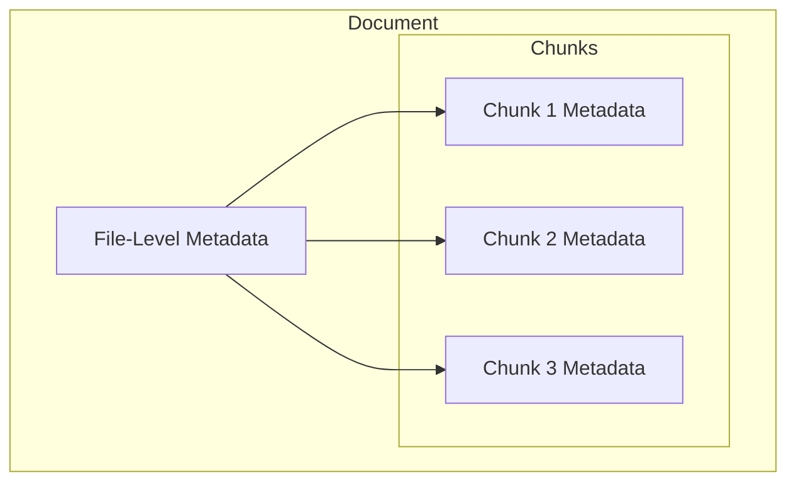

Metadata represents the actual extracted values that result from applying Tags to your documents. While Tags define *what* to extract, Metadata is the *extracted data* itself.

## Metadata Properties

| Property | Description | Example |
| :-- | :-- | :-- |
| **Values** | The extracted or classified value(s) | `["NDA", "Non-Disclosure Agreement"]` |
| **Evidence** | Text snippet supporting the extraction | "This Non-Disclosure Agreement is entered into..." |
| **Confidence** | AI confidence score (0-1) | `0.95` |

<Tip>
The **Evidence** field shows exactly where the AI found the information, making it easy to verify extractions and understand the source.
</Tip>

## Metadata Levels

| Level | Description | Use Case |
| :-- | :-- | :-- |
| **File-Level** | Aggregated metadata for the entire document | Document classification, search filters |
| **Chunk-Level** | Granular metadata per text segment | Precise evidence location, RAG retrieval |


```mermaid
flowchart TD
    subgraph doc [Document]
        FL[File-Level Metadata]
        subgraph chunks [Chunks]
            C1[Chunk 1 Metadata]
            C2[Chunk 2 Metadata]
            C3[Chunk 3 Metadata]
        end
    end
    
    FL --> C1
    FL --> C2
    FL --> C3
```

## Metadata Standardization

The platform includes AI-powered standardization to clean and normalize extracted values:

| Feature | Description |
| :-- | :-- |
| **Deduplication** | Merge similar values (e.g., "Inc." and "Incorporated") |
| **Normalization** | Standardize formats (dates, currencies, names) |
| **Bulk Standardization** | Apply standardization across multiple tags |

<Note>
Standardization helps ensure consistency across your metadata, making it easier to search, filter, and analyze your documents.
</Note>

## How Metadata Generation Works

<Steps>
  <Step title="Document Processing">
    Documents are chunked and prepared for analysis.
  </Step>
  <Step title="Tag Application">
    The AI applies your Tags to extract or classify information from each chunk.
  </Step>
  <Step title="Evidence Capture">
    The system captures the text snippet that supports each extraction.
  </Step>
  <Step title="Aggregation">
    Chunk-level metadata is aggregated to create file-level metadata.
  </Step>
  <Step title="Standardization">
    Optional normalization and deduplication cleans the results.
  </Step>
</Steps>

## Example Metadata Output

For a contract document with a "Contract Type" classification tag:

```json
{
  "tag": "Contract Type",
  "values": ["NDA"],
  "evidence": "This Non-Disclosure Agreement ('Agreement') is entered into as of January 1, 2024...",
  "confidence": 0.97
}
```

---

## Python SDK

<Tabs>
  <Tab title="Generate Metadata">
```python
from unstructured import UnstructuredClient

client = UnstructuredClient(
    base_url="https://unstructured.your-company.com/rest/unstructured",
    username="your-username",
    password="your-password",
)

# Generate metadata for specific documents
result = client.metadata.generate.generate(
    data_connector_name="my-s3-bucket",
    file_names=["contract.pdf"],
    tag_names=["contract_type", "effective_date", "total_value"],
)
print(result.message)
```
  </Tab>
  <Tab title="Batch Processing">
```python
import uuid

# Generate metadata for all documents in a connector (background job)
job_id = str(uuid.uuid4())
client.metadata.generate.generate_batch(
    data_connector_name="my-s3-bucket",
    tag_names=["contract_type", "effective_date", "total_value"],
    job_id=job_id,
)

# Track progress
progress = client.task_status.get_status(job_id=job_id)
print(f"Classification {progress.percent_complete:.0f}% complete ({progress.status})")
```
  </Tab>
  <Tab title="List Metadata">
```python
# List metadata for documents (dict keyed by file name)
metadata = client.metadata.list(
    data_connector_name="my-s3-bucket",
    tag_names=["contract_type", "effective_date"],
)
for file_name, tags in metadata.metadata.items():
    print(f"{file_name}: {tags}")

# Paginated listing for large datasets
all_metadata, offset = {}, 0
while offset is not None:
    page = client.metadata.list_paginated(
        data_connector_name="my-s3-bucket",
        limit=200,
        offset=offset,
    )
    all_metadata.update(page.metadata or {})
    offset = page.next_offset
print(f"Fetched metadata for {len(all_metadata)} files")
```
  </Tab>
  <Tab title="Upsert & Delete">
```python
# Manually upsert metadata (e.g. write a review status back)
client.metadata.upsert(
    data_connector_name="my-s3-bucket",
    metadata={
        "contract.pdf": {
            "contract_type": {
                "file_level": {
                    "values": ["NDA"],
                    "evidence": "Manually verified by legal team.",
                },
            },
        },
    },
)

# Delete metadata for specific files
client.metadata.delete(
    data_connector_name="my-s3-bucket",
    file_names=["old-contract.pdf"],
)
```
  </Tab>
  <Tab title="Standardize">
```python
import uuid

# Preview AI-suggested standardizations for messy values
suggestion = client.metadata.standardization_suggest(
    data_connector_name="my-s3-bucket",
    tag_names=["counterparty_name"],
    description="Consolidate company-name variants into one canonical legal name",
    processing_mode="entity_resolution",  # or: deduplicate, smart_clustering, map_to_categories
)

# Apply standardization across tags in bulk (background job)
client.metadata.standardization_bulk(
    vdb_profile_name="my-s3-bucket",
    tag_names=["counterparty_name", "contract_type"],
    job_id=str(uuid.uuid4()),
)
```
  </Tab>
</Tabs>

---

## API Reference

<CardGroup cols={2}>
  <Card title="Generate Metadata" icon="wand-magic-sparkles" href="/api-reference/metadata/generate">
    Generate metadata for documents
  </Card>
  <Card title="Generate Batch" icon="layer-group" href="/api-reference/metadata/generate-batch">
    Generate metadata for multiple documents
  </Card>
  <Card title="Upsert Metadata" icon="pen" href="/api-reference/metadata/upsert">
    Create or update metadata
  </Card>
  <Card title="List Metadata" icon="list" href="/api-reference/metadata/list">
    List metadata for documents
  </Card>
  <Card title="List Paginated" icon="file-lines" href="/api-reference/metadata/list-paginated">
    Paginated metadata listing
  </Card>
  <Card title="Delete Metadata" icon="trash" href="/api-reference/metadata/delete">
    Remove metadata
  </Card>
</CardGroup>
