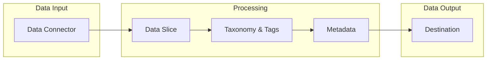

This guide covers the core concepts you'll work with in Unstructured by Collibra. Understanding these building blocks is essential for effectively using the platform to enrich your unstructured data with intelligent metadata.

<CardGroup cols={2}>
  <Card title="Projects" icon="folder-open" href="/concepts/projects">
    Organize your work into focused workspaces
  </Card>
  <Card title="Data Connectors" icon="plug" href="/concepts/data-connectors">
    Connect to your document repositories
  </Card>
  <Card title="Data Slices" icon="filter" href="/concepts/data-slices">
    Filter documents for targeted processing
  </Card>
  <Card title="Taxonomies & Tags" icon="tags" href="/concepts/taxonomies-tags">
    Define what metadata to extract
  </Card>
  <Card title="Metadata" icon="database" href="/concepts/metadata">
    The structured output from your documents
  </Card>
  <Card title="Destinations" icon="arrow-right-from-bracket" href="/concepts/destinations">
    Export enriched data to external systems
  </Card>
</CardGroup>

---

## How It All Works Together

Here's how all the concepts connect in a typical workflow:

<Steps>
  <Step title="Connect Your Data">
    Use a **Data Connector** to establish a secure connection to your document storage (S3, SharePoint, databases).
  </Step>
  <Step title="Define What to Extract">
    Create **Tags** organized in **Taxonomies** to specify what metadata you want to capture from your documents.
  </Step>
  <Step title="Focus Your Scope">
    Optionally create a **Data Slice** to filter and process only the documents you need.
  </Step>
  <Step title="Extract Metadata">
    The platform processes your documents and generates **Metadata** — the actual extracted values with evidence and confidence scores.
  </Step>
  <Step title="Export Results">
    Send enriched data to a **Destination** like a vector database or document management system.
  </Step>
</Steps>

---

## Quick Reference

| Concept | What It Does | Think of It Like... |
| :-- | :-- | :-- |
| **Data Connector** | Connects to where your documents live | Plugging in an external drive |
| **Destination** | Sends enriched data to other systems | Exporting to share |
| **Project** | Work with specific data sources and taxonomies | A project folder |
| **Tag** | Defines what info to extract | A question on a form |
| **Taxonomy** | Organizes tags into a structure | An outline or checklist |
| **Metadata** | The actual extracted information | The filled-out answers |
| **Data Slice** | Filters to specific documents | A saved search |
