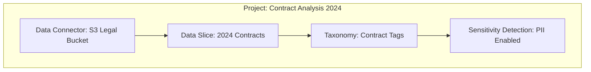

Projects are organizational containers that group related work together — including Data Connectors, taxonomies, and sensitivity detection settings. Think of a Project as a workspace for a specific initiative.

## Example Use Cases

- **Contract Analysis 2024** — for processing legal contracts
- **HR Document Compliance** — for employee document PII detection
- **Financial Reports Q4** — for extracting financial metrics

## Project Components

| Component | Description | Required |
| :-- | :-- | :-- |
| **Name** | Unique identifier for the project | Yes |
| **Description** | Optional notes about the project purpose | No |
| **Data Connectors** | One or more connected data repositories | At least one |
| **Data Slice** | Optional filtered subset of data | No (defaults to "All Data") |
| **Taxonomies** | One or more tag hierarchies to apply | No |
| **Sensitive Data Detection** | Enable PII/PHI/PCI scanning | No |

## Project Structure

## Sensitivity Detection Options

When creating a project, you can enable automatic sensitive data detection:

| Type | Full Name | Examples |
| :-- | :-- | :-- |
| **PII** | Personal Identifiable Information | Names, emails, addresses, phone numbers, SSN |
| **PHI** | Protected Health Information | Medical records, diagnoses, prescriptions, insurance IDs |
| **PCI** | Payment Card Industry Data | Credit card numbers, bank accounts, payment details |

<Tip>
Enable sensitivity detection to automatically flag documents containing protected information. This is especially useful for compliance workflows in healthcare, finance, and legal industries.
</Tip>

## Workflow Example

<Steps>
  <Step title="Create a Project">
    Give your project a descriptive name and optional description.
  </Step>
  <Step title="Connect Data Sources">
    Link one or more Data Connectors to bring in your documents.
  </Step>
  <Step title="Define Scope with Data Slices">
    Optionally filter to specific documents using a Data Slice.
  </Step>
  <Step title="Attach Taxonomies">
    Select which tag hierarchies to apply for metadata extraction.
  </Step>
  <Step title="Enable Sensitivity Detection">
    Turn on PII, PHI, or PCI scanning if needed for compliance.
  </Step>
</Steps>
