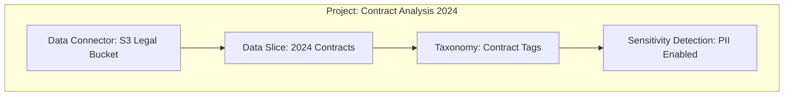

Projects are organizational containers that group related work together, including Data Connectors, taxonomies, and sensitivity detection settings. Think of a Project as a workspace for a specific initiative.

## Example Use Cases

- **Contract Analysis 2024** for processing legal contracts
- **HR Document Compliance** for employee document PII detection
- **Financial Reports Q4** for extracting financial metrics

## Project Components

| Component | Description | Required |
| :-- | :-- | :-- |
| **Name** | Unique identifier for the project | Yes |
| **Description** | Optional notes about the project purpose | No |
| **Data Connectors** | One or more connected data repositories | At least one |
| **Data Slice** | Optional filtered subset of data | No (defaults to "All Data") |
| **Taxonomies** | One or more tag hierarchies to apply | No |
| **Sensitive Data Detection** | Enable PII/PHI/PCI scanning | No |

## Project Structure


```mermaid
flowchart TB
    subgraph project [Project: Contract Analysis 2024]
        DC[Data Connector: S3 Legal Bucket]
        DS[Data Slice: 2024 Contracts]
        TAX[Taxonomy: Contract Tags]
        SEN[Sensitivity Detection: PII Enabled]
    end
    
    DC --> DS
    DS --> TAX
    TAX --> SEN
```

## Sensitivity Detection Options

When creating a project, you can enable automatic sensitive data detection:

| Type | Full Name | Examples |
| :-- | :-- | :-- |
| **PII** | Personal Identifiable Information | Names, emails, addresses, phone numbers, SSN |
| **PHI** | Protected Health Information | Medical records, diagnoses, prescriptions, insurance IDs |
| **PCI** | Payment Card Industry Data | Credit card numbers, bank accounts, payment details |

<Tip>
Enable sensitivity detection to automatically flag documents containing protected information. This is especially useful for compliance workflows in healthcare, finance, and legal industries.
</Tip>

## Workflow Example

<Steps>
  <Step title="Create a Project">
    Give your project a descriptive name and optional description.
  </Step>
  <Step title="Connect Data Sources">
    Link one or more Data Connectors to bring in your documents.
  </Step>
  <Step title="Define Scope with Data Slices">
    Optionally filter to specific documents using a Data Slice.
  </Step>
  <Step title="Attach Taxonomies">
    Select which tag hierarchies to apply for metadata extraction.
  </Step>
  <Step title="Enable Sensitivity Detection">
    Turn on PII, PHI, or PCI scanning if needed for compliance.
  </Step>
</Steps>

---

## Python SDK

<Tabs>
  <Tab title="Create Project">
```python
from unstructured import UnstructuredClient

client = UnstructuredClient(
    base_url="https://unstructured.your-company.com/rest/unstructured",
    username="your-username",
    password="your-password",
)

# Create a project grouping connectors, taxonomies, and detection settings
project = client.projects.create(
    name="Contract Analysis 2024",
    description="Processing legal contracts for the 2024 review",
    data_source=["my-s3-bucket"],
    taxonomy=["contract-analysis"],
    sensitive_data=True,  # Enable PII/PHI/PCI scanning
)
```
  </Tab>
  <Tab title="List & Get">
```python
# List all projects
projects = client.projects.list()

# Get a single project
project = client.projects.get("your-project-id")

# Review detected sensitive data for a project
sensitive = client.projects.get_sensitive_data("your-project-id")
```
  </Tab>
  <Tab title="Update & Delete">
```python
# Update a project
client.projects.update(
    "your-project-id",
    description="Updated scope: includes Q1 2025 contracts",
)

# Delete a project
client.projects.delete("your-project-id")
```
  </Tab>
</Tabs>

---

## API Reference

<CardGroup cols={2}>
  <Card title="Create Project" icon="plus" href="/api-reference/projects/create-project">
    Create a new project
  </Card>
  <Card title="List Projects" icon="list" href="/api-reference/projects/list-projects">
    List all your projects
  </Card>
  <Card title="Get Project" icon="magnifying-glass" href="/api-reference/projects/get-project">
    Retrieve a single project
  </Card>
  <Card title="Get Sensitive Data" icon="shield" href="/api-reference/projects/get-project-sensitive-data">
    Review detected sensitive data
  </Card>
</CardGroup>
