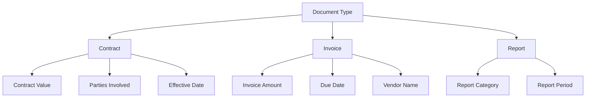

**Tags** are the metadata attributes you want to extract or classify from your documents. **Taxonomies** organize tags into hierarchical structures that define parent-child relationships.

## What is a Tag?

A Tag defines a specific piece of information you want to capture from documents:

| Property | Description | Example |
| :-- | :-- | :-- |
| **Name** | The tag identifier | `Contract Type` |
| **Description** | Instructions for the AI on what to extract | "Identify the type of legal agreement (NDA, MSA, SOW, etc.)" |
| **Output Type** | How values are returned | Word, Number, Date |
| **Max Values** | How many values get returned | 1 to however many relevant values an AI can find |
| **Available Values** | Predefined options (for classification) | `["NDA", "MSA", "SOW", "Employment Agreement"]` |
| **Strategy** | Extraction method | LLM (AI), Regex (Pattern), Rule-based |

## Tag Types

| Tag Type | How It Works | When to Use | Example |
| :-- | :-- | :-- | :-- |
| **Classification Tags** | AI chooses from predefined list of values | When you have a known set of categories | Document Type: Contract, Invoice, Report |
| **Extraction Tags** | AI extracts open-ended values from text | When the value is unpredictable | Contract Value: $1,500,000 |
| **Pattern Tags** | Regex pattern matching or NLP detection | For compliance, keyword-search, etc. | SSN: XXX-XX-XXXX, Email: user@domain.com |

<Tip>
**Classification** is best when you have a known set of categories. **Extraction** is best for unpredictable values like names, dates, or amounts. **Pattern** is best for structured data like phone numbers or SSNs.
</Tip>

## Taxonomy Structure

A Taxonomy enables hierarchical organization and conditional extraction. Child tags only get generated when parent conditions are met:

```
Document Type (Classification: Contract | Invoice | Report)
├── Contract
│   ├── Contract Value (Extraction)
│   ├── Parties Involved (Extraction)
│   ├── Effective Date (Extraction)
│   └── Termination Date (Extraction)
├── Invoice
│   ├── Invoice Amount (Extraction)
│   ├── Due Date (Extraction)
│   └── Vendor Name (Extraction)
└── Report
    ├── Report Category (Classification: Financial | Operational | Compliance)
    └── Report Period (Extraction)
```



<Note>
In this taxonomy, the AI first classifies the document type, then only extracts the relevant child tags. A Contract won't have "Invoice Amount" extracted — saving time and cost.
</Note>

## Creating Effective Tags

<Steps>
  <Step title="Define Clear Descriptions">
    Give the AI specific instructions about what to extract. The better your description, the more accurate the extraction.
  </Step>
  <Step title="Choose the Right Type">
    Use Classification for known categories, Extraction for open-ended values, and Pattern for structured formats.
  </Step>
  <Step title="Set Available Values">
    For Classification tags, provide a complete list of possible values to improve accuracy.
  </Step>
  <Step title="Organize into Taxonomies">
    Group related tags hierarchically to enable conditional extraction and reduce unnecessary processing.
  </Step>
</Steps>

---

## API Reference

<CardGroup cols={2}>
  <Card title="Upsert Tag" icon="plus" href="/api-reference/tags/upsert">
    Create or update a tag
  </Card>
  <Card title="List Tags" icon="list" href="/api-reference/tags/list">
    List all your tags
  </Card>
  <Card title="Delete Tag" icon="trash" href="/api-reference/tags/delete">
    Remove a tag
  </Card>
  <Card title="Suggest Patterns" icon="wand-magic-sparkles" href="/api-reference/tags/suggest-patterns">
    AI-powered pattern suggestions
  </Card>
</CardGroup>

<CardGroup cols={2}>
  <Card title="Upsert Taxonomy" icon="sitemap" href="/api-reference/taxonomies/upsert">
    Create or update a taxonomy
  </Card>
  <Card title="List Taxonomies" icon="list" href="/api-reference/taxonomies/list">
    List all your taxonomies
  </Card>
  <Card title="Delete Taxonomy" icon="trash" href="/api-reference/taxonomies/delete">
    Remove a taxonomy
  </Card>
  <Card title="Suggest Taxonomy" icon="wand-magic-sparkles" href="/api-reference/taxonomies/suggest">
    AI-powered taxonomy suggestions
  </Card>
</CardGroup>
