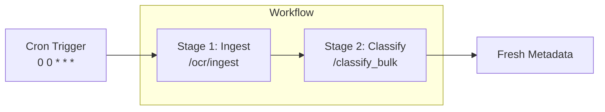

Workflows chain platform operations into scheduled, repeatable pipelines. Instead of manually re-running ingestion and classification as new documents arrive, define the sequence once and let it run on a cron cadence, or trigger it on demand.

## Anatomy of a Workflow

| Field | Description | Example |
| :-- | :-- | :-- |
| **Name** | Identifier shown in the UI's workflow table | `"Nightly prepare: contracts"` |
| **Cadence** | Cron expression for the schedule | `"0 0 * * *"` (daily at midnight) |
| **Stages** | Ordered list, each stage runs after the previous completes | Ingest, then Classify |
| **Jobs** | API calls within a stage (endpoint + request body) | `/ocr/ingest`, `/classify_bulk` |



<Tip>
Stages run **sequentially**; jobs inside a stage run together. Put ingestion and classification in separate stages so classification always sees the newly ingested documents.
</Tip>

---

## Python SDK

<Tabs>
  <Tab title="Create Workflow">
```python
from unstructured import UnstructuredClient

client = UnstructuredClient(
    base_url="https://unstructured.your-company.com/rest/unstructured",
    username="your-username",
    password="your-password",
)

# Nightly ingest + classify pipeline (same shape the web UI creates)
result = client.workflows.upsert(
    workflow={
        "name": "Nightly prepare: contracts",
        "description": "Ingest new documents and re-classify every night",
        "cadence": "0 0 * * *",  # cron expression
        "stages": [
            {
                "jobs": [
                    {
                        "endpoint": "/ocr/ingest",
                        "endpoint_request_body": {
                            "data_connector_name": "my-s3-bucket",
                        },
                    },
                ],
            },
            {
                "jobs": [
                    {
                        "endpoint": "/classify_bulk",
                        "endpoint_request_body": {
                            "data_connector_name": "my-s3-bucket",
                        },
                    },
                ],
            },
        ],
    },
)
```
  </Tab>
  <Tab title="Run On Demand">
```python
# Execute a workflow immediately instead of waiting for the cadence
client.workflows.execute(workflow_id="your-workflow-id")
```
  </Tab>
  <Tab title="List & Delete">
```python
# List workflows
workflows = client.workflows.list()

# Delete a workflow
client.workflows.delete(workflow_id="your-workflow-id")
```
  </Tab>
</Tabs>

---

## API Reference

<CardGroup cols={2}>
  <Card title="Upsert Workflow" icon="plus" href="/api-reference/workflows/upsert-workflow">
    Create or update a workflow
  </Card>
  <Card title="Execute Workflow" icon="play" href="/api-reference/workflows/execute-workflow">
    Trigger a workflow on demand
  </Card>
  <Card title="List Workflows" icon="list" href="/api-reference/workflows/list-workflows">
    List all your workflows
  </Card>
  <Card title="Delete Workflow" icon="trash" href="/api-reference/workflows/delete-workflow">
    Remove a workflow
  </Card>
</CardGroup>
