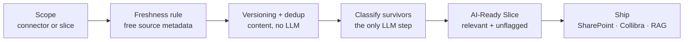

The heart of Deasy Labs is turning a messy source into a curated, AI-ready dataset. In the app this is the Data Quality screen: Summary, Uniqueness, Freshness, Metadata, and AI Ready Data. The same flow runs headlessly through the SDK, so you can trigger a scan, write the signals, and produce a curated slice as part of your own pipeline.

The steps run in cost order. Freshness and deduplication use metadata the platform captured for free at ingestion and content signals that need no LLM, so they shrink the corpus first. AI classification, the expensive step, runs only on the documents that survive. Only data that passes the gate reaches your destination.

<Note>
The platform does the heavy lifting. Ingestion captures source metadata (`Last Modified`, `File Type`, `Created By`, `Folder Structure`, and more) on every document, the versioning and duplicate detection engines work on content without LLM calls, and classification extracts the standard quality tags (`Title`, `Author`, `Document Type`, `Document Date`, `Version`). The SDK orchestrates and reuses that metadata; it never re-implements it.
</Note>

## The Flow



## Configuration

The quality tags below are the platform's standard extracted tags. The coverage threshold and freshness cutoff are your use case's rules; the same file can be ready for one use case and not another.

```python
from unstructured import UnstructuredClient

client = UnstructuredClient(
    base_url="https://unstructured.your-company.com/rest/unstructured",
    username="your-username",
    password="your-password",
)

CONNECTOR       = "my-sharepoint"
QUALITY_TAGS    = ["Title", "Author", "Document Type", "Document Date"]
MIN_COVERAGE    = 80          # percent of files that must carry each quality tag
FRESHNESS_CUTOFF_YEAR = 2023  # documents older than this are expired for this use case
MISSING_MARKERS = {"Not found", "", None}
```

## Step 1. Expire Stale Files First

`Last Modified` comes from the source system and was captured automatically at ingestion, so this filter costs nothing. Files older than your cutoff get `Data Quality Status = expired`, written through `metadata.upsert`, the same signal-write path the app's freshness service uses. Every file expired here is a file you never pay to classify.

```python
def file_value(file_meta, tag):
    """Read a tag's first file-level value, tolerant of dict or model access."""
    td = file_meta.get(tag) if isinstance(file_meta, dict) else getattr(file_meta, tag, None)
    if td is None:
        return None
    fl = td.get("file_level") if isinstance(td, dict) else getattr(td, "file_level", None)
    values = (fl.get("values") if isinstance(fl, dict) else getattr(fl, "values", None)) if fl else None
    if not values or values[0] in MISSING_MARKERS:
        return None
    return str(values[0])

metadata_by_file, offset = {}, 0
while offset is not None:
    page = client.metadata.list_paginated(
        data_connector_name=CONNECTOR, limit=200, offset=offset)
    metadata_by_file.update(page.metadata or {})
    offset = page.next_offset
total_files = len(metadata_by_file)

expired = []
for file_name, file_meta in metadata_by_file.items():
    modified = file_value(file_meta, "Last Modified")
    year = int(modified[:4]) if modified and modified[:4].isdigit() else None
    if year and year < FRESHNESS_CUTOFF_YEAR:
        expired.append(file_name)

if expired:
    client.metadata.upsert(
        data_connector_name=CONNECTOR,
        metadata={
            fn: {"Data Quality Status": {"file_level": {
                "values": ["expired"],
                "evidence": f"Last modified before the {FRESHNESS_CUTOFF_YEAR} cutoff for this use case.",
            }}}
            for fn in expired
        },
    )
print(f"{len(expired)}/{total_files} file(s) expired before any LLM call")
```

<Note>
`Last Modified` is the free first pass. After classification runs in Step 3, `Document Date` (the date a document states about itself) is the stronger signal; re-apply the cutoff with it for precision, as in [Keep Answers Current Over Time](/cookbooks/freshness-curation).
</Note>

## Step 2. Drop Duplicates and Old Versions

Versioning clusters documents that are versions of the same logical document by content, no LLM calls involved. Run it, then let the platform's selection keep the latest copy per group.

```python
import time
import uuid

version_job = str(uuid.uuid4())
client.versioning.run(data_connector_name=CONNECTOR, job_id=version_job)
while client.task_status.get_status(job_id=version_job).status == "in_progress":
    time.sleep(10)

versions = client.versioning.retrieve_versions(data_connector_name=CONNECTOR)
```

Within each group, the latest version is determined from the strongest unambiguous signal: `Document Date` if present, then source-system timestamps like `Last Modified`, then extracted `Version` identifiers. The platform's duplicate detection (the Uniqueness tab in the app) applies that priority, recommends the canonical copy, and tags the rest `Data Quality Status = redundant`. Superseded copies are tagged and excluded, not deleted, so every decision is auditable and reversible.

<Note>
Exact duplicates (`...copy 2`, re-uploads) are caught by content hash the same way and also receive `Data Quality Status = redundant`. Every duplicate flagged here is another file you never pay to classify. Identity-based grouping gets even better once tags exist, so heavily duplicated sources are worth a second dedup pass after Step 3.
</Note>

## Step 3. Classify Only the Survivors

Now the expensive step, scoped to the smallest possible set. Create a working slice that excludes everything flagged so far, check tag coverage on it, and run the classification job against that slice only. Expired and redundant files never touch the LLM.

```python
survivors = client.data_slice.create(
    data_connector_name=CONNECTOR,
    dataslice_name="needs-tagging",
    description="Unflagged files only. Scopes classification to the surviving set.",
    condition={
        "tag": {"name": "Data Quality Status", "operator": "not_exists"},
    },
)

# Coverage check on the survivors
surviving_meta = {
    fn: fm for fn, fm in metadata_by_file.items()
    if not file_value(fm, "Data Quality Status")
}
coverage = {}
for tag in QUALITY_TAGS:
    have = sum(1 for fm in surviving_meta.values() if file_value(fm, tag))
    coverage[tag] = 100 * have / len(surviving_meta) if surviving_meta else 0
gaps = [t for t in QUALITY_TAGS if coverage[t] < MIN_COVERAGE]

if gaps:
    job_id = str(uuid.uuid4())
    client.metadata.generate.generate_batch(
        data_connector_name=CONNECTOR,
        dataslice_id=survivors.dataslice_id,   # only the surviving files
        tag_names=gaps,
        job_id=job_id,
    )
    while True:
        progress = client.task_status.get_status(job_id=job_id)
        if progress.status in ("completed", "failed", "aborted"):
            break
        print(f"  Extracting missing metadata {progress.percent_complete:.0f}%...")
        time.sleep(10)
    print(f"Classification {progress.status}")
```

This mirrors what the Data Quality screen does when coverage is below threshold: it kicks off a background classification job, tracked in the Command Center.

## Step 4. Select the Relevant Files and Create the AI-Ready Slice

Readiness has two sides. Quality says a file is trustworthy; relevance says it belongs to this use case. Both are decided by metadata:

- **Relevance is a positive selection** on the tags you extracted. A contracts assistant wants `Document Type` in contracts and agreements, not canteen menus that happen to live in the same library.
- **Quality is an exclusion** on `Data Quality Status`, the platform's shared quality flag. A document tagged with it is either `redundant` (a duplicate or superseded copy, written by the platform's duplicate detection), `expired` (out of date for this use case, written by the freshness rule), or otherwise flagged as unfit, such as `irrelevant`. A document with no `Data Quality Status` tag has passed every quality check.

The slice combines both, using the same `not_exists` exclusion the platform's own AI-ready slice creation uses. Filtering to a slice is the heart of the experience: a slice is a use case.

```python
ai_ready = client.data_slice.create(
    data_connector_name=CONNECTOR,
    dataslice_name="ai-ready-knowledge-base",
    description="Relevant document types only, no expired, redundant, or flagged files.",
    condition={
        "condition": "AND",
        "children": [
            # Relevance: only the document types this use case needs
            {"tag": {"name": "Document Type", "operator": "in",
                     "values": ["Contract", "Agreement", "Policy"]}},
            # Quality: no file carrying any Data Quality Status flag
            {"tag": {"name": "Data Quality Status", "operator": "not_exists"}},
        ],
    },
)
print(f"AI-ready slice: {ai_ready.dataslice_id}")

count = client.data_slice.file_count(
    data_connector_name=CONNECTOR,
    dataslice_id=ai_ready.dataslice_id,
)
```

## Step 5. Ship It

Only data that passes the gate reaches the destination.

```python
# To a destination (SharePoint, SQL, S3) with metadata alongside
client.destination.export(
    destination_name="my-destination",
    data_connector_name=CONNECTOR,
    dataslice_id=ai_ready.dataslice_id,
    export_level="file",
    export_metadata=True,
)

# Or into a vector database for RAG
client.data_slice.export_vdb(
    target_data_connector_name="rag-vectors",
    ori_data_connector_name=CONNECTOR,
    dataslice_id=ai_ready.dataslice_id,
    export_level="chunk",
)
```

## How to Use This

- **In your own pipeline.** Everything above is plain SDK calls: trigger the scan, write the signals, produce the slice, ship it. Schedule it with a [Workflow](/concepts/workflows) or your own orchestrator.
- **Cost order matters.** Freshness and dedup are metadata and content checks; classification is the LLM spend. Filtering first means you tag the smallest possible set, and re-runs only classify what's new.
- **Per use case.** Run it once per use case with different quality tags, thresholds, cutoffs, and relevance selections. The same file can be ready for one slice and not another.
- **In the app.** The Data Quality screen runs this same flow interactively, with review steps for duplicates and expiring files, and the Command Center tracks the background jobs.

## Next Steps

<CardGroup cols={2}>
  <Card title="Keep Answers Current Over Time" icon="clock" href="/cookbooks/freshness-curation">
    The full freshness flow, including the Document Date refinement.
  </Card>
  <Card title="Protect Sensitive Data" icon="shield" href="/cookbooks/pii-detection">
    Add the opt-in sensitivity dimension to the gate.
  </Card>
  <Card title="Clean Up a RAG Index" icon="database" href="/cookbooks/qdrant-to-qdrant">
    Ship the curated slice into a vector database.
  </Card>
  <Card title="Data Slices" icon="layer-group" href="/concepts/data-slices">
    The condition syntax behind the gate.
  </Card>
</CardGroup>
