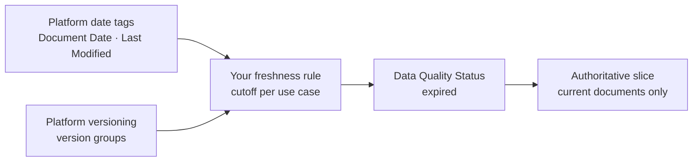

An agent should answer from current documents, not a draft from 2003. Freshness in Deasy Labs is a use-case rule applied to metadata the platform already holds: you set the cutoff, the flow tags out-of-date files with `Data Quality Status = expired`, and the AI-ready slice excludes them. In the app this is the Freshness tab of the Data Quality screen; this cookbook runs the same flow headlessly through the SDK.

<Note>
You are not extracting dates yourself. Ingestion captures `Last Modified` from the source system automatically, and classification extracts `Document Date` (the date a document states about itself) as one of the platform's standard quality tags. This cookbook reuses those signals; expired files are tagged and excluded, not deleted, so every decision is auditable and reversible.
</Note>

## The Flow



## Configuration

The cutoff is your use case's rule. A policy library might expire documents after three years; a contracts workspace might never expire signed agreements.

```python
from unstructured import UnstructuredClient

client = UnstructuredClient(
    base_url="https://unstructured.your-company.com/rest/unstructured",
    username="your-username",
    password="your-password",
)

CONNECTOR   = "my-sharepoint"
CUTOFF_YEAR = 2023   # documents older than this are expired for this use case
```

## Step 1. Read the Platform's Date Tags

`Document Date` is the strongest signal (what the document says about itself); `Last Modified` from the source system is the fallback. This is the same signal priority the platform's own latest-version selection uses.

```python
def file_value(file_meta, tag):
    """Read a tag's first file-level value, tolerant of dict or model access."""
    td = file_meta.get(tag) if isinstance(file_meta, dict) else getattr(file_meta, tag, None)
    if td is None:
        return None
    fl = td.get("file_level") if isinstance(td, dict) else getattr(td, "file_level", None)
    values = (fl.get("values") if isinstance(fl, dict) else getattr(fl, "values", None)) if fl else None
    if not values or values[0] in ("Not found", ""):
        return None
    return str(values[0])

meta, offset = {}, 0
while offset is not None:
    page = client.metadata.list_paginated(
        data_connector_name=CONNECTOR,
        tag_names=["Document Date", "Last Modified"],
        limit=200, offset=offset)
    meta.update(page.metadata or {})
    offset = page.next_offset

def best_year(file_meta):
    for tag in ("Document Date", "Last Modified"):
        value = file_value(file_meta, tag)
        if value and value[:4].isdigit():
            return int(value[:4])
    return None

rows = [{"filename": fn, "year": best_year(fm)} for fn, fm in meta.items()]
undated = [r for r in rows if r["year"] is None]
print(f"{len(rows)} files, {len(undated)} without a usable date")
```

If many files lack a `Document Date`, run a classification job for it first, as in [Prepare an AI-Ready Dataset](/cookbooks/data-quality). Undated files are your curation backlog.

## Step 2. Group Versions with Platform Versioning

The platform's versioning job clusters documents that are versions of the same logical document. It runs as a background job; the result is version groups you can combine with the date signals to find superseded copies.

```python
import time
import uuid

job_id = str(uuid.uuid4())
client.versioning.run(data_connector_name=CONNECTOR, job_id=job_id)
while True:
    progress = client.task_status.get_status(job_id=job_id)
    if progress.status in ("completed", "failed", "aborted"):
        break
    print(f"  Version clustering {progress.percent_complete:.0f}%...")
    time.sleep(10)

versions = client.versioning.retrieve_versions(data_connector_name=CONNECTOR)
```

<Note>
Choosing the canonical copy within each group is what the platform's duplicate detection does on the Data Quality screen: it recommends the latest version by `Document Date`, then source timestamps, then extracted `Version`, and flags the rest. Review those recommendations in the app's Uniqueness tab.
</Note>

## Step 3. Apply the Cutoff and Write the Signal

Files older than your cutoff get `Data Quality Status = expired`, written through `metadata.upsert`. This is the same signal-write path the app's freshness service uses, so the result is indistinguishable from running the flow in the UI.

```python
expired = [r["filename"] for r in rows if r["year"] and r["year"] < CUTOFF_YEAR]

if expired:
    client.metadata.upsert(
        data_connector_name=CONNECTOR,
        metadata={
            fn: {"Data Quality Status": {"file_level": {
                "values": ["expired"],
                "evidence": f"Dated before the {CUTOFF_YEAR} cutoff for this use case.",
            }}}
            for fn in expired
        },
    )
print(f"Marked {len(expired)} file(s) expired")

# Verify the write by reading the tag back
check, offset = {}, 0
while offset is not None:
    page = client.metadata.list_paginated(
        data_connector_name=CONNECTOR, tag_names=["Data Quality Status"],
        limit=200, offset=offset)
    check.update(page.metadata or {})
    offset = page.next_offset
confirmed = sum(
    1 for fn in expired if file_value(check.get(fn, {}), "Data Quality Status") == "expired")
print(f"Verified {confirmed}/{len(expired)} expired tags persisted.")
```

## Step 4. Slice to Current Documents

Freshness is the share of files not tagged `expired`. The `not_exists` condition below excludes every file carrying any `Data Quality Status` value, whether `expired` from this rule, `redundant` from the platform's duplicate detection, or otherwise flagged. Only unflagged documents make the authoritative set, the same condition the platform's AI-ready slice creation uses.

```python
authoritative = client.data_slice.create(
    data_connector_name=CONNECTOR,
    dataslice_name="authoritative-current",
    description="Current documents only. Safe for agent consumption.",
    condition={
        "tag": {"name": "Data Quality Status", "operator": "not_exists"},
    },
)

total = len(rows)
print("=" * 50)
print(f"  FRESHNESS SCORECARD  {CONNECTOR}")
print("=" * 50)
print(f"  Total documents  {total:>5}")
print(f"  Expired          {len(expired):>5}")
print(f"  Undated          {len(undated):>5}   curation gap")
print(f"  Freshness        {100 * (total - len(expired)) / total if total else 0:>5.1f}%")
```

## How to Use This

- **As an agent guardrail.** Point agents and RAG pipelines at the authoritative slice so they never answer from expired content.
- **Per use case.** The cutoff belongs to the use case, not the corpus. The same file can be current for one slice and expired for another.
- **On a schedule.** Re-run the flow with a [Workflow](/concepts/workflows) so freshness keeps up as documents change.

## Next Steps

<CardGroup cols={2}>
  <Card title="Prepare an AI-Ready Dataset" icon="filter" href="/cookbooks/data-quality">
    The full readiness flow this rule plugs into.
  </Card>
  <Card title="Scope Chatbot Answers with Metadata" icon="comments" href="/cookbooks/metadata-filtered-rag">
    Let users scope questions to current documents.
  </Card>
  <Card title="Workflows" icon="clock" href="/concepts/workflows">
    Schedule the freshness re-scan.
  </Card>
  <Card title="Data Slices" icon="layer-group" href="/concepts/data-slices">
    The condition syntax behind the authoritative slice.
  </Card>
</CardGroup>
