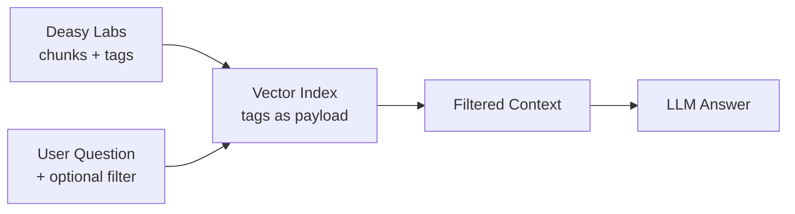

The metadata tags Deasy Labs extracts become retrieval filters for a RAG chatbot. A user can ask "answer using only Supplier Agreements" or "only documents governed by California law", and the retriever narrows the candidate pool before the LLM sees a single chunk. Filtered retrieval keeps answers grounded in the right documents instead of the most superficially similar ones.

## What You'll Build



## Prerequisites

- A data connector with ingested and classified documents
- Python 3.9+ with `qdrant-client`, `fastembed`, and `openai` installed

```bash
pip install unstructured_sdk-*.whl qdrant-client fastembed openai
```

## Step 1. Pull Chunk Text and File-Level Tags

Fetch each file's tags with `metadata.list_paginated`, then the chunk text with `data_source.list_ingested_data`. Each chunk record carries its file's tag values.

```python
from unstructured import UnstructuredClient

client = UnstructuredClient(
    base_url="https://unstructured.your-company.com/rest/unstructured",
    username="your-username",
    password="your-password",
)

CONNECTOR = "my-s3-bucket"
FILTERABLE_TAGS = ["contract_type", "counterparty_name", "governing_law"]

def file_level_value(file_meta, tag):
    """Read a tag's first file-level value, tolerant of dict or model access."""
    td = file_meta.get(tag) if isinstance(file_meta, dict) else getattr(file_meta, tag, None)
    if td is None:
        return None
    fl = td.get("file_level") if isinstance(td, dict) else getattr(td, "file_level", None)
    values = (fl.get("values") if isinstance(fl, dict) else getattr(fl, "values", None)) if fl else None
    if not values or values == ["Not found"]:
        return None
    return str(values[0])

def chunk_text(chunk):
    """Extract chunk text, tolerant of varying chunk shapes."""
    if not isinstance(chunk, dict):
        return ""
    for key in ("text", "content", "document_text", "page_content"):
        value = chunk.get(key)
        if isinstance(value, str) and value.strip():
            return value.strip()
    return ""

# Tags per file
meta, offset = {}, 0
while offset is not None:
    page = client.metadata.list_paginated(
        data_connector_name=CONNECTOR, tag_names=FILTERABLE_TAGS,
        limit=200, offset=offset)
    meta.update(page.metadata or {})
    offset = page.next_offset
filenames = sorted(meta.keys())

# Chunk text per file
resp = client.data_source.list_ingested_data(
    data_connector_name=CONNECTOR, file_names=filenames,
    group_by="file", limit=len(filenames))
ingested = resp.metadata or {}

records = []
for fn in filenames:
    tag_values = {t: file_level_value(meta.get(fn, {}), t) for t in FILTERABLE_TAGS}
    chunks = ingested.get(fn)
    if not isinstance(chunks, dict):
        continue
    for chunk_id, chunk in chunks.items():
        text = chunk_text(chunk)
        if text:
            records.append({"filename": fn, "text": text, **tag_values})

print(f"Collected {len(records)} chunks from {len(filenames)} files")
```

## Step 2. Embed and Index with Tags as Payload

Every chunk goes into the vector index with its tag values attached as payload fields.

```python
from qdrant_client import QdrantClient
from qdrant_client.models import Distance, VectorParams, PointStruct
from fastembed import TextEmbedding

embedder = TextEmbedding(model_name="BAAI/bge-small-en-v1.5")
vectors = list(embedder.embed([r["text"] for r in records]))

qdrant = QdrantClient(":memory:")  # swap for your persistent cluster in production
qdrant.create_collection(
    "documents",
    vectors_config=VectorParams(size=len(vectors[0]), distance=Distance.COSINE),
)
qdrant.upsert("documents", points=[
    PointStruct(
        id=i,
        vector=vectors[i].tolist(),
        payload={"filename": r["filename"], "text": r["text"],
                 **{t: r[t] for t in FILTERABLE_TAGS}},
    )
    for i, r in enumerate(records)
])
print(f"Indexed {len(records)} chunks")
```

## Step 3. Ask, with Optional Metadata Filters

The filter narrows the candidate pool before similarity search runs. Without it, retrieval considers every chunk in the corpus.

```python
import os

from openai import OpenAI
from qdrant_client.models import Filter, FieldCondition, MatchValue

openai_client = OpenAI(api_key=os.environ["OPENAI_API_KEY"])

def ask(question, filters=None, top_k=5):
    query_vector = next(iter(embedder.embed([question]))).tolist()
    query_filter = None
    if filters:
        query_filter = Filter(must=[
            FieldCondition(key=k, match=MatchValue(value=v))
            for k, v in filters.items()
        ])
    hits = qdrant.query_points(
        "documents", query=query_vector, limit=top_k,
        query_filter=query_filter).points
    if not hits:
        return "No matching context. The filter may be too narrow."

    context = "\n\n---\n\n".join(
        f"Source: {h.payload['filename']}\n{h.payload['text']}" for h in hits)
    response = openai_client.chat.completions.create(
        model="gpt-4.1", temperature=0, max_tokens=500,
        messages=[
            {"role": "system",
             "content": "Answer only from the provided context. If the answer is absent, say so."},
            {"role": "user",
             "content": f"Context:\n{context}\n\nQuestion: {question}"},
        ])
    return response.choices[0].message.content

# Unscoped: retrieval sees every document
print(ask("What are the key obligations and termination terms?"))

# Scoped: retrieval only sees Supplier Agreements
print(ask(
    "What are the key obligations and termination terms?",
    filters={"contract_type": "Supplier Agreement"},
))
```

## Step 4. Compare Filtered and Unfiltered Retrieval

Run the same question both ways and measure how the filter narrows the candidate pool. Pick a filter value that actually exists in your data.

```python
contract_types = sorted({r["contract_type"] for r in records if r["contract_type"]})
demo_filter = {"contract_type": contract_types[0]} if contract_types else None

question = "What are the key obligations and termination terms?"
hits_open = qdrant.query_points(
    "documents", query=next(iter(embedder.embed([question]))).tolist(), limit=5).points
hits_filtered = qdrant.query_points(
    "documents", query=next(iter(embedder.embed([question]))).tolist(), limit=5,
    query_filter=Filter(must=[
        FieldCondition(key=k, match=MatchValue(value=v))
        for k, v in (demo_filter or {}).items()
    ])).points if demo_filter else []

candidate_pool = sum(
    1 for r in records if demo_filter and all(r.get(k) == v for k, v in demo_filter.items()))

print("=" * 52)
print("  CHATBOT / METADATA-FILTER SCORECARD")
print("=" * 52)
print(f"  Indexed chunks            : {len(records)}")
print(f"  Retrieved (no filter)     : {len(hits_open)} chunks "
      f"across {len({h.payload['filename'] for h in hits_open})} files")
if demo_filter:
    print(f"  Candidate pool w/ filter  : {candidate_pool} chunks (filter: {demo_filter})")
    print(f"  Retrieved (filtered)      : {len(hits_filtered)} chunks "
          f"across {len({h.payload['filename'] for h in hits_filtered})} files")
print("=" * 52)
```

## Why Filtered Retrieval Wins

| | Unfiltered | Filtered by tag |
| :-- | :-- | :-- |
| Candidate pool | Every chunk in the corpus | Only chunks whose file matches the filter |
| Failure mode | Superficially similar but wrong-document chunks | Empty result if the filter is too narrow |
| Best for | Broad exploratory questions | Scoped questions ("in our NDAs...", "under California law...") |

<Tip>
Any tag you extract becomes a filter for free. The richer your taxonomy, the more precisely users can scope questions.
</Tip>

## How to Use This

- **Scope answers by any extracted tag.** Pass `filters={"governing_law": "California"}` or any other tag/value pair.
- **Swap the corpus.** Change `CONNECTOR` and `FILTERABLE_TAGS`; the pipeline adapts to whatever tags exist.
- **Productionize.** Point at a persistent Qdrant cluster instead of `:memory:`, or skip the manual indexing entirely and use `data_slice.export_vdb` as in the [Clean Up a RAG Index](/cookbooks/qdrant-to-qdrant). If your tag names contain spaces, slugify them before using them as payload keys; some vector stores cannot filter on keys with spaces.

## Next Steps

<CardGroup cols={2}>
  <Card title="Clean Up a RAG Index" icon="database" href="/cookbooks/qdrant-to-qdrant">
    Use the platform's own vector export instead of indexing manually.
  </Card>
  <Card title="Taxonomies and Tags" icon="tags" href="/concepts/taxonomies-tags">
    Design the tags that power your filters.
  </Card>
  <Card title="Keep Answers Current Over Time" icon="clock" href="/cookbooks/freshness-curation">
    Keep the chatbot answering from current documents only.
  </Card>
  <Card title="Data Quality Gate" icon="filter" href="/cookbooks/data-quality">
    Feed the index only documents that pass quality checks.
  </Card>
</CardGroup>
