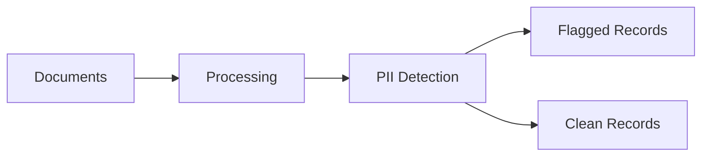

This cookbook shows you how to configure sensitive data detection (PII) in your document processing pipeline. You'll learn to automatically identify and flag personally identifiable information for compliance and data governance.

## What You'll Build

A pipeline that automatically detects and flags sensitive information in documents:



## Quick Start

```python
from unstructured import UnstructuredClient

client = UnstructuredClient(
    username="your-username",
    password="your-password",
)

# Create a PII-focused taxonomy
taxonomy = client.taxonomy.upsert(
    taxonomy_name="pii-detection",
    taxonomy_description="Detect sensitive personal information",
    tags=[
        {
            "name": "contains_ssn",
            "description": "Whether the document contains Social Security Numbers",
            "output_type": "boolean",
        },
        {
            "name": "contains_email",
            "description": "Whether the document contains email addresses",
            "output_type": "boolean",
        },
        {
            "name": "contains_phone",
            "description": "Whether the document contains phone numbers",
            "output_type": "boolean",
        },
        {
            "name": "pii_types_found",
            "description": "List of PII types detected (SSN, email, phone, address, etc.)",
            "output_type": "list[string]",
        },
        {
            "name": "sensitivity_level",
            "description": "Overall sensitivity: low, medium, high, critical",
            "output_type": "word",
        },
    ],
)

# Process documents
results = client.classify.generate_batch(
    connector_name="my-documents",
    taxonomy_name="pii-detection",
)

# Filter sensitive documents
sensitive_docs = [
    r for r in results.metadata 
    if r.tags.get("sensitivity_level") in ["high", "critical"]
]

print(f"Found {len(sensitive_docs)} highly sensitive documents")
for doc in sensitive_docs:
    print(f"  - {doc.file_name}: {doc.tags.get('pii_types_found')}")
```

## Using Regex Patterns for PII

For precise PII detection, use regex patterns in your tags:

```python
# Get AI-suggested patterns for common PII types
ssn_pattern = client.suggest.patterns(
    description="US Social Security Number in XXX-XX-XXXX format"
)
# Returns: r"\b\d{3}-\d{2}-\d{4}\b"

email_pattern = client.suggest.patterns(
    description="Email addresses"
)
# Returns: r"\b[A-Za-z0-9._%+-]+@[A-Za-z0-9.-]+\.[A-Z|a-z]{2,}\b"

# Create taxonomy with pattern-based tags
taxonomy = client.taxonomy.upsert(
    taxonomy_name="pii-regex-detection",
    taxonomy_description="Pattern-based PII detection",
    tags=[
        {
            "name": "ssn_matches",
            "description": "Social Security Numbers found",
            "output_type": "list[string]",
            "regex_pattern": r"\b\d{3}-\d{2}-\d{4}\b",
        },
        {
            "name": "email_matches",
            "description": "Email addresses found",
            "output_type": "list[string]",
            "regex_pattern": r"\b[A-Za-z0-9._%+-]+@[A-Za-z0-9.-]+\.[A-Z|a-z]{2,}\b",
        },
        {
            "name": "phone_matches",
            "description": "Phone numbers found",
            "output_type": "list[string]",
            "regex_pattern": r"\b\d{3}[-.]?\d{3}[-.]?\d{4}\b",
        },
    ],
)
```

## Complete Compliance Pipeline

Here's a production-ready pipeline for handling sensitive documents:

```python
from unstructured import UnstructuredClient

client = UnstructuredClient(
    username="your-username",
    password="your-password",
)

# ============================================
# Step 1: Set up connectors
# ============================================
# Source: where documents come from
source = client.data_source.create(
    connector_name="incoming-documents",
    connector_body={
        "vector_db_type": "s3",
        "bucket_name": "incoming-docs",
        "aws_access_key_id": "...",
        "aws_secret_access_key": "...",
        "region": "us-east-1",
    },
)

# Destination: where clean documents go
clean_dest = client.destination.create(
    destination_name="clean-archive",
    destination_body={
        "vector_db_type": "s3",
        "bucket_name": "clean-documents",
        "aws_access_key_id": "...",
        "aws_secret_access_key": "...",
        "region": "us-east-1",
    },
)

# Destination: where sensitive documents go for review
sensitive_dest = client.destination.create(
    destination_name="sensitive-review",
    destination_body={
        "vector_db_type": "s3",
        "bucket_name": "sensitive-documents",
        "aws_access_key_id": "...",
        "aws_secret_access_key": "...",
        "region": "us-east-1",
    },
)

# ============================================
# Step 2: Create PII taxonomy
# ============================================
taxonomy = client.taxonomy.upsert(
    taxonomy_name="compliance-pii",
    taxonomy_description="Comprehensive PII detection for compliance",
    tags=[
        {
            "name": "has_pii",
            "description": "Whether document contains any PII",
            "output_type": "boolean",
        },
        {
            "name": "pii_categories",
            "description": "Categories: financial, health, identity, contact",
            "output_type": "list[string]",
        },
        {
            "name": "risk_score",
            "description": "Risk score from 1-10 based on PII sensitivity",
            "output_type": "integer",
        },
    ],
)

# ============================================
# Step 3: Process and classify
# ============================================
results = client.classify.generate_batch(
    connector_name="incoming-documents",
    taxonomy_name="compliance-pii",
)

# ============================================
# Step 4: Create slices for routing
# ============================================
# Slice for clean documents (no PII or low risk)
clean_slice = client.dataslice.create(
    dataslice_name="clean-documents",
    connector_name="incoming-documents",
    conditions=[
        {"field": "has_pii", "operator": "eq", "value": False},
    ],
)

# Slice for sensitive documents (high risk)
sensitive_slice = client.dataslice.create(
    dataslice_name="sensitive-documents",
    connector_name="incoming-documents",
    conditions=[
        {"field": "risk_score", "operator": "gte", "value": 7},
    ],
)

# ============================================
# Step 5: Export to appropriate destinations
# ============================================
# Send clean docs to archive
client.destination.export(
    destination_name="clean-archive",
    dataslice_name="clean-documents",
    export_level="file",
    export_metadata=True,
)

# Send sensitive docs for review
client.destination.export(
    destination_name="sensitive-review",
    dataslice_name="sensitive-documents",
    export_level="file",
    export_metadata=True,
)

print("✓ Documents routed based on PII content")
```

## PII Categories Reference

| Category | Examples | Typical Risk |
| :-- | :-- | :-- |
| **Identity** | SSN, Passport, Driver's License | Critical |
| **Financial** | Credit Card, Bank Account, Tax ID | Critical |
| **Health** | Medical Records, Insurance ID, Diagnoses | High |
| **Contact** | Email, Phone, Address | Medium |
| **Biometric** | Fingerprints, Face Data, Voice | Critical |
| **Demographic** | Age, Gender, Ethnicity | Low-Medium |

## Best Practices

<AccordionGroup>
  <Accordion title="Combine AI + Regex" icon="wand-magic-sparkles">
    Use AI-based detection for context-aware classification, and regex patterns for precise matching:
    
    ```python
    tags=[
        # AI understands context
        {
            "name": "discusses_salary",
            "description": "Document discusses employee salary information",
            "output_type": "boolean",
        },
        # Regex catches exact patterns
        {
            "name": "ssn_values",
            "description": "Exact SSN values found",
            "output_type": "list[string]",
            "regex_pattern": r"\b\d{3}-\d{2}-\d{4}\b",
        },
    ]
    ```
  </Accordion>
  
  <Accordion title="Audit Trail" icon="clock-rotate-left">
    Keep metadata for compliance audits:
    
    ```python
    # Export with full metadata for audit
    client.destination.export(
        destination_name="audit-archive",
        connector_name="processed-documents",
        export_level="file",
        export_metadata=True,
        metadata_format="column_store",  # Easy to query
        export_tags=["has_pii", "pii_categories", "risk_score", "processed_date"],
    )
    ```
  </Accordion>
  
  <Accordion title="Incremental Scanning" icon="rotate">
    Process only new documents to save time:
    
    ```python
    # Slice for unprocessed documents
    new_docs = client.dataslice.create(
        dataslice_name="unscanned",
        connector_name="incoming-documents",
        conditions=[
            {"field": "pii_scanned", "operator": "is_null", "value": True},
        ],
    )
    ```
  </Accordion>
</AccordionGroup>

## Next Steps

<CardGroup cols={2}>
  <Card title="S3 to SharePoint" icon="microsoft" href="/cookbooks/s3-to-sharepoint">
    Export enriched metadata to SharePoint.
  </Card>
  <Card title="S3 to Qdrant" icon="database" href="/cookbooks/s3-to-qdrant">
    Build a complete RAG pipeline.
  </Card>
  <Card title="Custom Taxonomies" icon="tags" href="/cookbooks/custom-taxonomy">
    Use AI to generate custom taxonomies.
  </Card>
  <Card title="Data Slices" icon="filter" href="/concepts/data-slices">
    Learn advanced filtering techniques.
  </Card>
</CardGroup>
