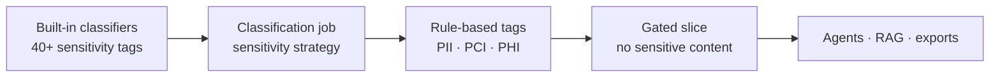

A customer-facing agent must not see PII. Deasy Labs ships a proprietary sensitive-data classification engine with 40+ built-in classifiers (Social Security Number, Credit Card, Date of Birth, Physical Address, and more) that combines pattern matching with AI context, understanding meaning, not just format. This cookbook runs that detection through the SDK and gates a data slice on the result, so restricted content never reaches downstream AI systems.

Sensitivity is an opt-in component of readiness, chosen per use case. In the app you enable it when creating a [Project](/concepts/projects); here you run it headlessly.

<Note>
You do not write detection logic. The classifiers are built in, and when sensitivity detection runs, the platform automatically adds three rule-based tags: `PII (Personally Identifiable Information)`, `PCI (Payment Card Industry Data)`, and `PHI (Protected Health Information)`. PII detection currently supports English documents only.
</Note>

## The Flow


```mermaid
flowchart LR
    CAT[Built-in classifiers<br/>40+ sensitivity tags] --> RUN[Classification job<br/>sensitivity strategy]
    RUN --> ROLL[Rule-based tags<br/>PII · PCI · PHI]
    ROLL --> GATE[Gated slice<br/>no sensitive content]
    GATE --> AI[Agents · RAG · exports]
```

## Step 1. Review the Built-In Sensitivity Catalog

```python
from unstructured import UnstructuredClient

client = UnstructuredClient(
    base_url="https://unstructured.your-company.com/rest/unstructured",
    username="your-username",
    password="your-password",
)

CONNECTOR = "my-sharepoint"

# The platform's built-in sensitivity classifiers
catalog = client.tags.list_sensitivity_defaults()
```

The catalog covers identity, financial, health, and contact data: Social Security Number, Credit Card, Tax ID, Date of Birth, Full Name, Physical Address, Phone Number, Policy Number, and more.

## Step 2. Run Sensitivity Detection

Include the sensitivity tags in a classification job. The platform runs its sensitivity strategy at the highest merge priority and writes the detected values, plus the `PII`, `PCI`, and `PHI` rule-based tags, as file-level metadata.

```python
import time
import uuid

SENSITIVITY_TAGS = ["Social Security Number", "Credit Card", "Date of Birth", "Full Name"]

job_id = str(uuid.uuid4())
client.metadata.generate.generate_batch(
    data_connector_name=CONNECTOR,
    tag_names=SENSITIVITY_TAGS,
    job_id=job_id,
)
while True:
    progress = client.task_status.get_status(job_id=job_id)
    if progress.status in ("completed", "failed", "aborted"):
        break
    print(f"  Sensitivity scan {progress.percent_complete:.0f}%...")
    time.sleep(10)
print(f"Scan {progress.status}")
```

## Step 3. Review What Was Found

Every detection carries evidence and confidence, so findings are auditable.

```python
results = client.metadata.list(
    data_connector_name=CONNECTOR,
    tag_names=["PII (Personally Identifiable Information)"],
)

flagged = []
for file_name, tags in (results.metadata or {}).items():
    pii = tags.get("PII (Personally Identifiable Information)")
    values = pii.file_level.values if pii and pii.file_level else []
    if values and str(values[0]).lower() in ("true", "yes"):
        flagged.append(file_name)

print(f"{len(flagged)} file(s) contain PII")
```

## Step 4. Encode the Policy as a Rule-Based Tag

Turn the detection results into a deterministic access verdict. A rule-based tag evaluates conditions over other tags' values at zero LLM cost: if a rule matches, the value resolves deterministically, and if none match, the tag falls back to its other configured strategy, pattern matching or LLM classification, depending on the tag definition.

```python
client.tags.upsert(tag_data={
    "name": "AI Agent Access",
    "description": "Whether AI agents may access this document",
    "output_type": "string",
    "available_values": ["Restricted", "Allowed"],
    "visual_rules": [
        {
            "condition": {
                "condition": "OR",
                "children": [
                    {"tag": {"name": "PII (Personally Identifiable Information)",
                             "operator": "in", "values": ["true"]}},
                    {"tag": {"name": "PHI (Protected Health Information)",
                             "operator": "in", "values": ["true"]}},
                ],
            },
            "tag_value": "Restricted",
        },
    ],
})
```

The policy now lives on the documents themselves: re-running classification re-evaluates the rule, and every downstream system reads one tag instead of re-deriving the logic.

## Step 5. Gate the Slice

Build the use case's slice so restricted content is excluded. This is the sensitivity component of the AI-ready gate: which dimensions matter, including whether sensitivity is part of the gate, is decided per use case.

```python
safe_for_agents = client.data_slice.create(
    data_connector_name=CONNECTOR,
    dataslice_name="agent-safe-knowledge",
    description="No PII, PCI, or PHI. Approved for customer-facing agent access.",
    condition={
        "condition": "AND",
        "children": [
            {"tag": {"name": "PII (Personally Identifiable Information)", "operator": "not_exists"}},
            {"tag": {"name": "PCI (Payment Card Industry Data)", "operator": "not_exists"}},
            {"tag": {"name": "PHI (Protected Health Information)", "operator": "not_exists"}},
        ],
    },
)
print(f"Gated slice: {safe_for_agents.dataslice_id}")
```

Export this slice, and only it, to the systems your agents read from. Documents with sensitive content stay behind the gate for review.

## Custom Patterns

For organization-specific identifiers (employee IDs, claim numbers, internal codes), describe the pattern and let the platform engineer it. You focus on defining what matters; the platform handles the pattern complexity.

```python
suggestion = client.tags.pattern.suggest_patterns(
    pattern_description="Internal employee ID in the format EMP-XXXXXX",
    tag_data={"name": "employee_id", "description": "Internal employee identifier"},
)
print(f"Suggested pattern: {suggestion.regex} (confidence: {suggestion.confidence_score})")

client.tags.upsert(tag_data={
    "name": "employee_id",
    "description": "Internal employee identifier",
    "output_type": "string",
    "patterns": [{"pattern": suggestion.regex}],
})
```

## PII Categories Reference

| Category | Examples | Typical Risk |
| :-- | :-- | :-- |
| **Identity** | SSN, Passport, Driver's License | Critical |
| **Financial** | Credit Card, Bank Account, Tax ID | Critical |
| **Health** | Medical Records, Insurance ID, Diagnoses | High |
| **Contact** | Email, Phone, Address | Medium |
| **Demographic** | Age, Gender, Religion | Low-Medium |

## How to Use This

- **Per use case.** An internal legal workspace may allow PII that a customer-facing agent must never see. Gate each slice with its own rules.
- **In a project.** Enable Sensitive Data Detection when creating a [Project](/concepts/projects) to make the scan part of the standard workspace setup.
- **Composed with quality.** Combine the sensitivity conditions with the `Data Quality Status` exclusion from [Prepare an AI-Ready Dataset](/cookbooks/data-quality) for a gate that covers both.

## Next Steps

<CardGroup cols={2}>
  <Card title="Prepare an AI-Ready Dataset" icon="filter" href="/cookbooks/data-quality">
    Add the quality dimensions to the gate.
  </Card>
  <Card title="Projects" icon="folder" href="/concepts/projects">
    Enable sensitivity detection per workspace.
  </Card>
  <Card title="Clean Up a RAG Index" icon="database" href="/cookbooks/qdrant-to-qdrant">
    Ship the gated slice to a vector database.
  </Card>
  <Card title="Taxonomies and Tags" icon="tags" href="/concepts/taxonomies-tags">
    Tag strategies: LLM, Pattern, Rule-based, Sensitivity.
  </Card>
</CardGroup>
