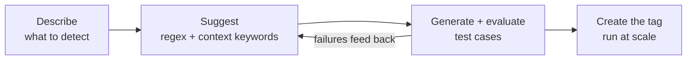

A bare regex is a false-positive machine: every nine-digit number becomes an SSN, every sixteen-digit number a credit card. Deasy Labs pattern tags avoid that with **context keywords**: the pattern only counts when corroborating words appear near the match. And you don't engineer either part by hand. Describe what matters, and the platform suggests the regex, the context keywords, and the corroboration threshold from your data, then generates test cases to prove precision before anything runs at scale.

## The Loop



## Step 1. Suggest the Pattern from Your Data

Give the platform a description and real examples. It returns the regex, the context keywords, the corroboration threshold, and an explanation of its reasoning.

```python
from unstructured import UnstructuredClient

client = UnstructuredClient(
    base_url="https://unstructured.your-company.com/rest/unstructured",
    username="your-username",
    password="your-password",
)

suggestion = client.tags.pattern.suggest_patterns(
    pattern_description="US Social Security Numbers in employee records",
    tag_data={"name": "ssn", "description": "US Social Security Numbers"},
    examples=["SSN: 123-45-6789", "Social Security Number 987-65-4321"],
    negative_examples=["Order #123-45-6789", "Part no. 987-65-4321"],
)

print(f"Regex:            {suggestion.regex}")
print(f"Context keywords: {suggestion.context_items}")
print(f"Required matches: {suggestion.required_context_matches}")
print(f"Reasoning:        {suggestion.explanation}")
```

The `negative_examples` are what teach it precision: the same digit shape in an order number must not match, so the suggestion leans on context keywords like "SSN" and "social security" to separate the two.

## Step 2. Prove It with Test Cases

Generate test cases covering matches, near-misses, and edge cases, then evaluate the pattern against them before it touches production data.

```python
generated = client.tags.pattern.generate_test_cases(
    pattern_descriptions=["US Social Security Numbers in employee records"],
    existing_patterns=[suggestion.regex],
    context_keywords=suggestion.context_items,
    tag_name="ssn",
)

evaluation = client.tags.pattern.evaluate_test_cases(
    patterns=[{"pattern": suggestion.regex,
               "context_items": suggestion.context_items,
               "required_context_matches": suggestion.required_context_matches}],
    test_cases=[
        {"text": tc.text, "should_match": tc.should_match, "category": tc.category}
        for tc in generated.test_cases
    ],
)

failures = [tc for tc in evaluation.evaluated_test_cases
            if tc.actual_match != tc.should_match]
print(f"{len(evaluation.evaluated_test_cases) - len(failures)}"
      f"/{len(evaluation.evaluated_test_cases)} test cases pass")
for tc in failures:
    print(f"  MISS [{tc.category}] {tc.text!r}")
```

If a case fails, feed it back: call `suggest_patterns` again with the failing text as `current_wrong_result` or an added negative example, and re-evaluate. The loop converges in a round or two.

## Step 3. Create the Tag and Run It

The tag carries the full pattern configuration. Detection is deterministic and costs no LLM calls at classification time.

```python
client.tags.upsert(tag_data={
    "name": "ssn",
    "description": "US Social Security Numbers",
    "output_type": "string",
    "patterns": [{
        "pattern": suggestion.regex,
        "context_items": suggestion.context_items,
        "required_context_matches": suggestion.required_context_matches,
    }],
})
```

Run it in a classification job like any other tag, then gate slices on the result as in [Protect Sensitive Data](/cookbooks/pii-detection).

## Why Context Keywords Matter

| | Bare regex | Pattern + context keywords |
| :-- | :-- | :-- |
| `123-45-6789` in "SSN: 123-45-6789" | Match | Match |
| `123-45-6789` in "Order #123-45-6789" | False positive | No match, no corroborating context |
| Cost at scale | Reprocessing false positives downstream | Deterministic, precise, no LLM |

## Next Steps

<CardGroup cols={2}>
  <Card title="Protect Sensitive Data" icon="shield" href="/cookbooks/pii-detection">
    The built-in classifiers and the gated slice.
  </Card>
  <Card title="Taxonomies and Tags" icon="tags" href="/concepts/taxonomies-tags">
    The three tag strategies side by side.
  </Card>
</CardGroup>
