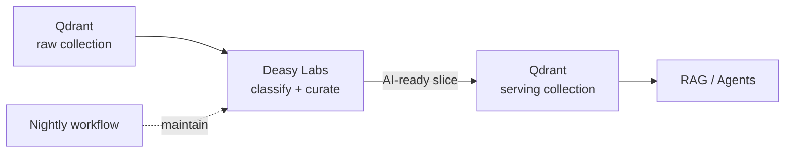

Your vector database already holds chunks; what it lacks is curation. This cookbook connects an existing Qdrant collection as a source, tags its content with AI-extracted metadata, and exports a curated slice into a clean serving collection. Retrieval moves from "everything, by similarity alone" to "gated documents, filterable by tags". A scheduled workflow keeps the serving collection maintained as the source evolves.

## What You'll Build



## Prerequisites

- A Qdrant instance with an existing collection of document chunks
- Python 3.9+

```bash
pip install unstructured_sdk-*.whl
```

## Step 1. Connect Both Collections

The source is your existing collection; the target is the curated serving collection your RAG pipeline will read from. `filename_key` and `text_key` tell the platform which payload fields hold the document name and chunk text.

```python
from unstructured import UnstructuredClient

client = UnstructuredClient(
    base_url="https://unstructured.your-company.com/rest/unstructured",
    username="your-username",
    password="your-password",
)

client.data_source.create(
    connector_name="raw-vectors",
    connector_body={
        "type": "QdrantVectorDBManager",
        "name": "raw-vectors",
        "url": "https://your-cluster.qdrant.io",
        "api_key": "YOUR_QDRANT_API_KEY",
        "collection_name": "all_documents",
        "filename_key": "filename",
        "text_key": "text",
    },
)

client.data_source.create(
    connector_name="serving-vectors",
    connector_body={
        "type": "QdrantVectorDBManager",
        "name": "serving-vectors",
        "url": "https://your-cluster.qdrant.io",
        "api_key": "YOUR_QDRANT_API_KEY",
        "collection_name": "ai_ready_documents",
    },
)
print("✓ Source and serving collections connected")
```

## Step 2. Tag the Existing Content

Classification runs over the chunks already in your collection. No re-ingestion of source files needed.

```python
import time
import uuid

for tag in [
    {
        "name": "document_type",
        "description": "Type of document (contract, policy, report, manual, etc.)",
        "output_type": "string",
        "available_values": ["contract", "policy", "report", "manual", "other"],
    },
    {
        "name": "department",
        "description": "Which department the document belongs to",
        "output_type": "string",
    },
    {
        "name": "Document Date",
        "description": "The date the document states about itself",
        "output_type": "date",
    },
]:
    client.tags.upsert(tag_data=tag)

job_id = str(uuid.uuid4())
client.metadata.generate.generate_batch(
    data_connector_name="raw-vectors",
    tag_names=["document_type", "department", "Document Date"],
    job_id=job_id,
)
while True:
    progress = client.task_status.get_status(job_id=job_id)
    if progress.status in ("completed", "failed", "aborted"):
        break
    print(f"  Classification {progress.percent_complete:.0f}%...")
    time.sleep(10)
print(f"✓ Classification {progress.status}")
```

## Step 3. Curate the Serving Slice

A slice is a use case. Scope the serving collection to what retrieval should actually see, and exclude anything carrying a `Data Quality Status` flag: documents tagged `redundant` by the platform's duplicate detection, `expired` by a freshness rule, or otherwise flagged as unfit. See [Prepare an AI-Ready Dataset](/cookbooks/data-quality) for the full readiness flow.

```python
serving_slice = client.data_slice.create(
    data_connector_name="raw-vectors",
    dataslice_name="rag-serving-set",
    description="Curated set for the RAG serving collection.",
    condition={
        "condition": "AND",
        "children": [
            {"tag": {"name": "document_type", "operator": "in",
                     "values": ["contract", "policy", "report", "manual"]}},
            {"tag": {"name": "Data Quality Status", "operator": "not_exists"}},
        ],
    },
)
print(f"✓ Serving slice: {serving_slice.dataslice_id}")
```

## Step 4. Export to the Serving Collection

```python
client.data_slice.export_vdb(
    target_data_connector_name="serving-vectors",
    ori_data_connector_name="raw-vectors",
    dataslice_id=serving_slice.dataslice_id,
    export_level="chunk",
)
print("✓ Serving collection populated")
```

Point your RAG pipeline at `ai_ready_documents`. Every chunk carries its tags, so retrieval can filter by `document_type`, `department`, or any tag you add. See [Scope Chatbot Answers with Metadata](/cookbooks/metadata-filtered-rag) for the retrieval side.

## Step 5. Maintain It Over Time

As the raw collection grows, keep the serving collection current: classify new content on a nightly cadence, then re-export the slice.

```python
client.workflows.upsert(
    workflow={
        "name": "Nightly maintain: rag serving set",
        "description": "Classify new content and refresh the serving collection every night",
        "cadence": "0 0 * * *",
        "stages": [
            {"jobs": [{"endpoint": "/classify_bulk",
                       "endpoint_request_body": {"data_connector_name": "raw-vectors"}}]},
            {"jobs": [{"endpoint": "/dataslice/export/vdb",
                       "endpoint_request_body": {
                           "target_data_connector_name": "serving-vectors",
                           "ori_data_connector_name": "raw-vectors",
                           "dataslice_id": serving_slice.dataslice_id,
                           "export_level": "chunk"}}]},
        ],
    },
)
print("✓ Nightly maintenance scheduled")
```

Combine with [Keep Answers Current Over Time](/cookbooks/freshness-curation) so expired documents drop out of the serving slice automatically, and answers never degrade as content ages.

## Next Steps

<CardGroup cols={2}>
  <Card title="Scope Chatbot Answers with Metadata" icon="comments" href="/cookbooks/metadata-filtered-rag">
    Use the exported tags as retrieval filters.
  </Card>
  <Card title="Keep Answers Current Over Time" icon="clock" href="/cookbooks/freshness-curation">
    Keep expired content out of the serving set.
  </Card>
  <Card title="Organize a SharePoint Library" icon="microsoft" href="/cookbooks/sharepoint-to-sharepoint">
    Enrich document libraries at the source.
  </Card>
  <Card title="Vector Databases" icon="database" href="/integrations/vector-databases">
    The integration overview.
  </Card>
</CardGroup>
