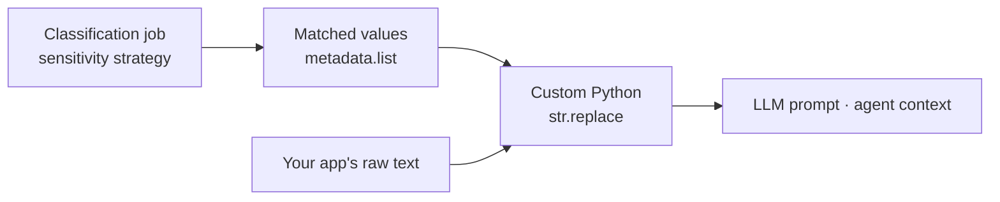

Sometimes a document should not be withheld entirely, only the sensitive parts inside it. A support ticket might be fine for an agent to read except for the customer's credit card number. This cookbook takes the values Deasy Labs already detected and masks them out of the text your application sends to an LLM, using plain Python.

<Note>
Deasy Labs detects sensitive values today. It does not modify document content. Masking the matched values out of text is something your application does, using the detections as input. This is a best-effort, literal-value replacement, not a guarantee: the platform returns the matched strings, not character offsets, so formatting variants that were not themselves detected will not be caught. If you need certainty, exclude the whole file from the slice instead, as covered in [Protect Sensitive Data](/cookbooks/pii-detection).
</Note>

## The Flow



## Step 1. Run Sensitivity Detection

This is the same detection job used in [Protect Sensitive Data](/cookbooks/pii-detection). Pick the classifiers whose matched values you want to mask, not the rollup tags: rollup tags like `PII (Personally Identifiable Information)` resolve to `true`/`false` and carry no literal value to redact.

```python
import time
import uuid
from unstructured import UnstructuredClient

client = UnstructuredClient(
    base_url="https://unstructured.your-company.com/rest/unstructured",
    username="your-username",
    password="your-password",
)

CONNECTOR = "my-sharepoint"
SENSITIVITY_TAGS = ["Social Security Number", "Credit Card", "Email Address", "Phone Number"]

job_id = str(uuid.uuid4())
client.metadata.generate.generate_batch(
    data_connector_name=CONNECTOR,
    tag_names=SENSITIVITY_TAGS,
    job_id=job_id,
)
while True:
    progress = client.task_status.get_status(job_id=job_id)
    if progress.status in ("completed", "failed", "aborted"):
        break
    time.sleep(10)
```

## Step 2. Read Back the Matched Values

When a sensitivity tag has no fixed set of `available_values`, the matched text itself becomes the tag's value. Collect those values per file.

```python
results = client.metadata.list(
    data_connector_name=CONNECTOR,
    tag_names=SENSITIVITY_TAGS,
)

matches_by_file = {}
for file_name, tags in (results.metadata or {}).items():
    matched = []
    for tag_name in SENSITIVITY_TAGS:
        tag = tags.get(tag_name)
        if tag and tag.file_level and tag.file_level.values:
            matched.extend(str(value) for value in tag.file_level.values)
    if matched:
        matches_by_file[file_name] = matched
```

## Step 3. Mask the Matched Values

This part is plain Python, nothing Deasy-specific. Replace the longest values first, so a short match inside a longer one (an area code inside a full phone number, for instance) does not leave a partial value behind.

```python
def redact(text, matched_values, placeholder="[REDACTED]"):
    for value in sorted(set(matched_values), key=len, reverse=True):
        text = text.replace(value, placeholder)
    return text
```

## Step 4. Mask Before You Prompt

Apply it wherever your application builds the text it sends to an LLM or agent, using the file's own raw content, however your pipeline already reads it.

```python
raw_text = load_text_from_source(file_name)  # your app's own file read, not a Deasy Labs call
safe_text = redact(raw_text, matches_by_file.get(file_name, []))

response = your_llm_client.complete(prompt=safe_text)
```

## A Worked Example

Say the source file is a support ticket. This is the text your application already has, before any masking:

```text
Hi, I'm locked out of my account. My SSN on file is 123-45-6789 and my
card is 4111 1111 1111 1111. You can reach me at jane.doe@example.com
or 415-555-0192 if you need to verify my identity.
```

After Step 1 and Step 2, `matches_by_file["ticket-4821.txt"]` holds the literal values the classification job found in that file:

```python
["123-45-6789", "4111 1111 1111 1111", "jane.doe@example.com", "415-555-0192"]
```

Running `redact(raw_text, matches_by_file["ticket-4821.txt"])` from Step 3 on that text produces:

```text
Hi, I'm locked out of my account. My SSN on file is [REDACTED] and my
card is [REDACTED]. You can reach me at [REDACTED]
or [REDACTED] if you need to verify my identity.
```

Only the four matched values changed. Everything else in the ticket, the parts an agent needs to actually help the customer, is untouched. If the classification job did not catch a value (a typo'd SSN, a phone number in an unexpected format), it will not be in the list and will not be masked, which is the literal-value limitation called out above.

## How to Use This

- **For inline masking, not exclusion.** Use this when a document is mostly fine to share and only specific values need to be hidden. To keep a whole file out of AI systems, gate a slice instead, as in [Protect Sensitive Data](/cookbooks/pii-detection).
- **Pick literal-value tags.** Only classifiers without a fixed `available_values` list return the matched text as their value. Rollup tags (`PII`, `PCI`, `PHI`) are booleans and have nothing to replace.
- **Re-run after re-classification.** Matched values reflect the last classification job. If the source document changes, re-run detection before trusting the redaction.

## Next Steps

<CardGroup cols={2}>
  <Card title="Protect Sensitive Data" icon="shield-halved" href="/cookbooks/pii-detection">
    Gate an entire slice on sensitivity tags instead of masking inline.
  </Card>
  <Card title="Precision Patterns for Sensitive Data" icon="crosshairs" href="/cookbooks/precision-patterns">
    Add custom identifiers to the sensitivity catalog before you redact them.
  </Card>
  <Card title="Metadata" icon="tags" href="/concepts/metadata">
    How tag values and evidence are stored per file.
  </Card>
  <Card title="Prepare an AI-Ready Dataset" icon="filter" href="/cookbooks/data-quality">
    Combine masking with the quality dimensions of the AI-ready gate.
  </Card>
</CardGroup>
