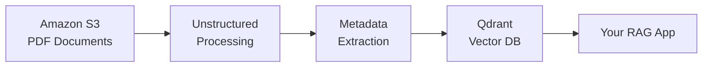

This cookbook walks you through building a production-ready RAG (Retrieval-Augmented Generation) pipeline. You'll ingest documents from Amazon S3, extract structured metadata, and load everything into Qdrant for semantic search.

## What You'll Build



## Prerequisites

- An S3 bucket with PDF documents
- A Qdrant instance (cloud or self-hosted)
- Python 3.9+

```bash
pip install unstructured-sdk
```

## Complete Pipeline

```python
from unstructured import UnstructuredClient

# Initialize the client
client = UnstructuredClient(
    username="your-username",
    password="your-password",
)

# ============================================
# Step 1: Connect to S3 (Source)
# ============================================
s3_connector = client.data_source.create(
    connector_name="my-document-bucket",
    connector_body={
        "vector_db_type": "s3",
        "bucket_name": "company-documents",
        "aws_access_key_id": "YOUR_ACCESS_KEY",
        "aws_secret_access_key": "YOUR_SECRET_KEY",
        "region": "us-east-1",
        "prefix": "contracts/",  # Optional: only process files in this folder
    },
)
print(f"✓ Connected to S3: {s3_connector.profile_id}")

# ============================================
# Step 2: Connect to Qdrant (Destination)
# ============================================
qdrant_dest = client.destination.create(
    destination_name="rag-vectors",
    destination_body={
        "vector_db_type": "qdrant",
        "url": "https://your-cluster.qdrant.io",
        "api_key": "YOUR_QDRANT_API_KEY",
        "collection_name": "document_chunks",
    },
)
print(f"✓ Connected to Qdrant: {qdrant_dest.destination_id}")

# ============================================
# Step 3: Define Your Taxonomy
# ============================================
taxonomy = client.taxonomy.upsert(
    taxonomy_name="contract-analysis",
    taxonomy_description="Extract key information from legal contracts",
    tags=[
        {
            "name": "contract_type",
            "description": "Type of contract (NDA, MSA, SLA, Employment, etc.)",
            "output_type": "word",
        },
        {
            "name": "parties",
            "description": "Names of all parties involved in the contract",
            "output_type": "list[string]",
        },
        {
            "name": "effective_date",
            "description": "When the contract becomes effective",
            "output_type": "date",
        },
        {
            "name": "expiration_date",
            "description": "When the contract expires or terminates",
            "output_type": "date",
        },
        {
            "name": "key_obligations",
            "description": "Main obligations and responsibilities outlined",
            "output_type": "list[string]",
        },
        {
            "name": "total_value",
            "description": "Total monetary value of the contract if specified",
            "output_type": "float",
        },
    ],
)
print(f"✓ Created taxonomy: {taxonomy.taxonomy_id}")

# ============================================
# Step 4: Ingest and Process Documents
# ============================================
print("Processing documents...")
results = client.classify.generate_batch(
    connector_name="my-document-bucket",
    taxonomy_name="contract-analysis",
)
print(f"✓ Processed {len(results.metadata)} documents")

# ============================================
# Step 5: Export to Qdrant
# ============================================
export_result = client.destination.export(
    destination_name="rag-vectors",
    connector_name="my-document-bucket",
    export_level="chunk",      # Export at chunk level for RAG
    export_nodes=True,         # Include vector embeddings
    export_metadata=True,      # Include extracted metadata
    metadata_format="json_store",
)
print(f"✓ Exported to Qdrant")

# If large export, track progress
if export_result.tracker_id:
    status = client.progress_tracker.get_status(tracker_id=export_result.tracker_id)
    print(f"  Export status: {status.status} ({status.progress}%)")
```

## Query Your RAG Pipeline

Once your data is in Qdrant, you can query it with any Qdrant client:

```python
from qdrant_client import QdrantClient

# Connect to Qdrant
qdrant = QdrantClient(
    url="https://your-cluster.qdrant.io",
    api_key="YOUR_QDRANT_API_KEY",
)

# Semantic search with metadata filtering
results = qdrant.search(
    collection_name="document_chunks",
    query_vector=your_embedding,  # Your query embedding
    query_filter={
        "must": [
            {"key": "contract_type", "match": {"value": "NDA"}},
            {"key": "effective_date", "range": {"gte": "2024-01-01"}},
        ]
    },
    limit=5,
)

for hit in results:
    print(f"Score: {hit.score}")
    print(f"Text: {hit.payload['text'][:200]}...")
    print(f"Parties: {hit.payload['parties']}")
    print("---")
```

## Understanding Export Options

| Option | Description | When to Use |
| :-- | :-- | :-- |
| `export_level="file"` | One record per document | Document-level retrieval |
| `export_level="chunk"` | One record per chunk | RAG / semantic search |
| `export_level="both"` | Both file and chunk records | Hybrid use cases |
| `export_nodes=True` | Include vector embeddings | Required for semantic search |
| `metadata_format="json_store"` | Metadata as JSON column | Flexible filtering |
| `metadata_format="column_store"` | Metadata as separate columns | SQL-style queries |

## Production Tips

<AccordionGroup>
  <Accordion title="Handle Large Batches" icon="layer-group">
    For large document sets (100+ files), the export runs asynchronously. Poll the tracker:
    
    ```python
    import time
    
    while True:
        status = client.progress_tracker.get_status(tracker_id=export_result.tracker_id)
        if status.status == "completed":
            print("Export finished!")
            break
        elif status.status == "failed":
            print(f"Export failed: {status.error}")
            break
        print(f"Progress: {status.progress}%")
        time.sleep(5)
    ```
  </Accordion>
  
  <Accordion title="Incremental Updates" icon="rotate">
    Use Data Slices to process only new documents:
    
    ```python
    # Create a slice for recent documents
    slice = client.dataslice.create(
        dataslice_name="recent-contracts",
        connector_name="my-document-bucket",
        conditions=[
            {"field": "last_modified", "operator": "gte", "value": "2024-01-01"}
        ],
    )
    
    # Process only the slice
    results = client.classify.generate_batch(
        dataslice_name="recent-contracts",
        taxonomy_name="contract-analysis",
    )
    ```
  </Accordion>
  
  <Accordion title="Error Handling" icon="triangle-exclamation">
    Wrap operations in try-except for production robustness:
    
    ```python
    from unstructured.exceptions import UnstructuredError
    
    try:
        results = client.classify.generate_batch(...)
    except UnstructuredError as e:
        print(f"Processing failed: {e.message}")
        # Handle retry logic
    ```
  </Accordion>
</AccordionGroup>

## Next Steps

<CardGroup cols={2}>
  <Card title="S3 to SharePoint" icon="microsoft" href="/cookbooks/s3-to-sharepoint">
    Export metadata to SharePoint columns.
  </Card>
  <Card title="PII Detection" icon="shield" href="/cookbooks/pii-detection">
    Add sensitive data detection to your pipeline.
  </Card>
  <Card title="Custom Taxonomies" icon="tags" href="/cookbooks/custom-taxonomy">
    Use AI to generate custom taxonomies.
  </Card>
  <Card title="Destinations" icon="arrow-right" href="/concepts/destinations">
    Explore all supported export targets.
  </Card>
</CardGroup>
