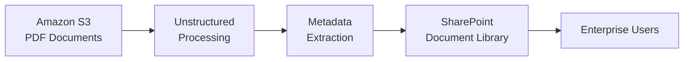

This cookbook walks you through building a document enrichment pipeline. You'll ingest documents from Amazon S3, extract structured metadata, and push the enriched data to SharePoint as document columns.

## What You'll Build



## Prerequisites

- An S3 bucket with PDF documents
- A SharePoint site with appropriate permissions
- Python 3.9+

```bash
pip install unstructured-sdk
```

## Complete Pipeline

```python
from unstructured import UnstructuredClient

# Initialize the client
client = UnstructuredClient(
    username="your-username",
    password="your-password",
)

# ============================================
# Step 1: Connect to S3 (Source)
# ============================================
s3_connector = client.data_source.create(
    connector_name="my-document-bucket",
    connector_body={
        "vector_db_type": "s3",
        "bucket_name": "company-documents",
        "aws_access_key_id": "YOUR_ACCESS_KEY",
        "aws_secret_access_key": "YOUR_SECRET_KEY",
        "region": "us-east-1",
        "prefix": "contracts/",  # Optional: only process files in this folder
    },
)
print(f"✓ Connected to S3: {s3_connector.profile_id}")

# ============================================
# Step 2: Connect to SharePoint (Destination)
# ============================================
sharepoint_dest = client.destination.create(
    destination_name="contract-library",
    destination_body={
        "vector_db_type": "sharepoint",
        "client_id": "YOUR_CLIENT_ID",
        "client_secret": "YOUR_CLIENT_SECRET",
        "tenant_id": "YOUR_TENANT_ID",
        "site_name": "LegalDocuments",
    },
)
print(f"✓ Connected to SharePoint: {sharepoint_dest.destination_id}")

# ============================================
# Step 3: Define Your Taxonomy
# ============================================
taxonomy = client.taxonomy.upsert(
    taxonomy_name="contract-analysis",
    taxonomy_description="Extract key information from legal contracts",
    tags=[
        {
            "name": "contract_type",
            "description": "Type of contract (NDA, MSA, SLA, Employment, etc.)",
            "output_type": "word",
        },
        {
            "name": "parties",
            "description": "Names of all parties involved in the contract",
            "output_type": "list[string]",
        },
        {
            "name": "effective_date",
            "description": "When the contract becomes effective",
            "output_type": "date",
        },
        {
            "name": "expiration_date",
            "description": "When the contract expires or terminates",
            "output_type": "date",
        },
        {
            "name": "key_obligations",
            "description": "Main obligations and responsibilities outlined",
            "output_type": "list[string]",
        },
        {
            "name": "total_value",
            "description": "Total monetary value of the contract if specified",
            "output_type": "float",
        },
    ],
)
print(f"✓ Created taxonomy: {taxonomy.taxonomy_id}")

# ============================================
# Step 4: Ingest and Process Documents
# ============================================
print("Processing documents...")
results = client.classify.generate_batch(
    connector_name="my-document-bucket",
    taxonomy_name="contract-analysis",
)
print(f"✓ Processed {len(results.metadata)} documents")

# ============================================
# Step 5: Export to SharePoint
# ============================================
export_result = client.destination.export(
    destination_name="contract-library",
    connector_name="my-document-bucket",
    export_level="file",           # Export at file level for SharePoint
    export_metadata=True,          # Include extracted metadata
    metadata_format="column_store", # Create separate SharePoint columns
    export_tags=[                   # Specify which tags become columns
        "contract_type",
        "parties",
        "effective_date",
        "expiration_date",
        "total_value",
    ],
)
print(f"✓ Exported to SharePoint")

# If large export, track progress
if export_result.tracker_id:
    status = client.progress_tracker.get_status(tracker_id=export_result.tracker_id)
    print(f"  Export status: {status.status} ({status.progress}%)")
```

## What Happens in SharePoint

Once exported, your SharePoint document library will have new columns populated with the extracted metadata:

| Document | Contract Type | Parties | Effective Date | Total Value |
| :-- | :-- | :-- | :-- | :-- |
| Acme-NDA-2024.pdf | NDA | Acme Corp, Beta LLC | 2024-01-15 | - |
| ServiceAgreement.pdf | MSA | TechCo, StartupXYZ | 2024-03-01 | $150,000 |
| Employment-JDoe.pdf | Employment | Jane Doe, Acme Corp | 2024-02-01 | $95,000 |

Users can now:
- **Filter and sort** documents by contract type, date, or value
- **Create views** like "Expiring This Quarter" or "High-Value Contracts"
- **Search** using SharePoint's native search with metadata facets
- **Set up alerts** for documents matching specific criteria

## Understanding Export Options

| Option | Description | When to Use |
| :-- | :-- | :-- |
| `export_level="file"` | One record per document | SharePoint, document management |
| `export_level="chunk"` | One record per chunk | Vector databases, RAG |
| `export_level="both"` | Both file and chunk records | Hybrid use cases |
| `metadata_format="column_store"` | Metadata as separate columns | SharePoint, SQL databases |
| `metadata_format="json_store"` | Metadata as JSON column | Flexible NoSQL storage |
| `export_tags=[...]` | Specific tags to export | Control which columns are created |

## Production Tips

<AccordionGroup>
  <Accordion title="Handle Large Batches" icon="layer-group">
    For large document sets (100+ files), the export runs asynchronously. Poll the tracker:
    
    ```python
    import time
    
    while True:
        status = client.progress_tracker.get_status(tracker_id=export_result.tracker_id)
        if status.status == "completed":
            print("Export finished!")
            break
        elif status.status == "failed":
            print(f"Export failed: {status.error}")
            break
        print(f"Progress: {status.progress}%")
        time.sleep(5)
    ```
  </Accordion>
  
  <Accordion title="Incremental Updates" icon="rotate">
    Use Data Slices to process only new documents:
    
    ```python
    # Create a slice for recent documents
    slice = client.dataslice.create(
        dataslice_name="recent-contracts",
        connector_name="my-document-bucket",
        conditions=[
            {"field": "last_modified", "operator": "gte", "value": "2024-01-01"}
        ],
    )
    
    # Process only the slice
    results = client.classify.generate_batch(
        dataslice_name="recent-contracts",
        taxonomy_name="contract-analysis",
    )
    ```
  </Accordion>
  
  <Accordion title="Error Handling" icon="triangle-exclamation">
    Wrap operations in try-except for production robustness:
    
    ```python
    from unstructured.exceptions import UnstructuredError
    
    try:
        results = client.classify.generate_batch(...)
    except UnstructuredError as e:
        print(f"Processing failed: {e.message}")
        # Handle retry logic
    ```
  </Accordion>
</AccordionGroup>

## Next Steps

<CardGroup cols={2}>
  <Card title="PII Detection" icon="shield" href="/cookbooks/pii-detection">
    Add sensitive data detection to your pipeline.
  </Card>
  <Card title="Custom Taxonomies" icon="tags" href="/cookbooks/custom-taxonomy">
    Use AI to generate custom taxonomies.
  </Card>
  <Card title="Data Slices" icon="filter" href="/concepts/data-slices">
    Learn to filter documents for targeted processing.
  </Card>
  <Card title="Destinations" icon="arrow-right" href="/concepts/destinations">
    Explore all supported export targets.
  </Card>
</CardGroup>
