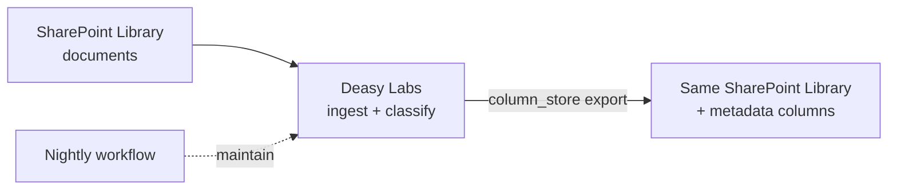

Enrich at the source. This cookbook connects a SharePoint document library, tags its documents with AI-extracted metadata, and writes the results back to the same library as native SharePoint columns. Users keep working where they always have, but now they can filter, sort, and search by contract type, dates, and value. A scheduled workflow keeps the columns current as documents change.

## What You'll Build



## Prerequisites

- A SharePoint site with a documents library and an Azure app registration (client ID, client secret, tenant ID)
- Python 3.9+

```bash
pip install unstructured_sdk-*.whl
```

## Step 1. Connect the SharePoint Source

```python
from unstructured import UnstructuredClient

client = UnstructuredClient(
    base_url="https://unstructured.your-company.com/rest/unstructured",
    username="your-username",
    password="your-password",
)

source = client.data_source.create(
    connector_name="legal-library",
    connector_body={
        "type": "SharepointDataSourceManager",
        "name": "legal-library",
        "client_id": "YOUR_CLIENT_ID",
        "client_secret": "YOUR_CLIENT_SECRET",
        "tenant_id": "YOUR_TENANT_ID",
        "sharepoint_site_name": "LegalDocuments",
    },
)
print(f"✓ Connected source: {source.profile_id}")
```

## Step 2. Ingest the Library

Ingestion runs as a background job and automatically captures source metadata (`Last Modified`, `File Type`, `Created By`, `Folder Structure`) on every document.

```python
import time
import uuid

ingest_job = str(uuid.uuid4())
client.data_source.ingest(
    data_connector_name="legal-library",
    job_id=ingest_job,
)
while client.task_status.get_status(job_id=ingest_job).status == "in_progress":
    time.sleep(10)
print("✓ Ingestion complete")
```

## Step 3. Define the Columns You Want

Each tag becomes a SharePoint column. Classification extracts the values with evidence and confidence.

```python
for tag in [
    {
        "name": "contract_type",
        "description": "Type of contract (NDA, MSA, SLA, Employment, etc.)",
        "output_type": "string",
        "available_values": ["NDA", "MSA", "SLA", "Employment", "Other"],
    },
    {
        "name": "effective_date",
        "description": "When the contract becomes effective",
        "output_type": "date",
    },
    {
        "name": "expiration_date",
        "description": "When the contract expires or terminates",
        "output_type": "date",
    },
    {
        "name": "total_value",
        "description": "Total monetary value of the contract if specified",
        "output_type": "number",
    },
]:
    client.tags.upsert(tag_data=tag)

classify_job = str(uuid.uuid4())
client.metadata.generate.generate_batch(
    data_connector_name="legal-library",
    tag_names=["contract_type", "effective_date", "expiration_date", "total_value"],
    job_id=classify_job,
)
while True:
    progress = client.task_status.get_status(job_id=classify_job)
    if progress.status in ("completed", "failed", "aborted"):
        break
    print(f"  Classification {progress.percent_complete:.0f}%...")
    time.sleep(10)
print(f"✓ Classification {progress.status}")
```

## Step 4. Write the Columns Back

The destination points at the same site. `column_store` creates one SharePoint column per exported tag.

```python
client.destination.create(
    connector_name="legal-library-columns",
    connector_body={
        "type": "SharepointNodeDestinationManager",
        "name": "legal-library-columns",
        "client_id": "YOUR_CLIENT_ID",
        "client_secret": "YOUR_CLIENT_SECRET",
        "tenant_id": "YOUR_TENANT_ID",
        "sharepoint_site_name": "LegalDocuments",
        "documents_library_folder_name": "Contracts",
    },
)

export_result = client.destination.export(
    destination_name="legal-library-columns",
    data_connector_name="legal-library",
    export_level="file",
    export_metadata=True,
    metadata_format="column_store",
    export_tags=["contract_type", "effective_date", "expiration_date", "total_value"],
)
print(f"✓ Exported {export_result.success} files ({export_result.failed} failed)")
```

## What Users See in SharePoint

| Document | Contract Type | Effective Date | Expiration Date | Total Value |
| :-- | :-- | :-- | :-- | :-- |
| Acme-NDA-2024.pdf | NDA | 2024-01-15 | 2026-01-15 | - |
| ServiceAgreement.pdf | MSA | 2024-03-01 | 2027-03-01 | $150,000 |
| Employment-JDoe.pdf | Employment | 2024-02-01 | - | $95,000 |

Users can filter and sort by any column, build views like "Expiring This Quarter", set alerts, and use SharePoint's native search with metadata facets.

## Step 5. Maintain It Over Time

New and changed documents should get columns without anyone re-running the flow. Schedule ingest and classify on a nightly cadence, the same shape the app's predefined workflows use, then re-export on your own trigger or a second workflow stage.

```python
client.workflows.upsert(
    workflow={
        "name": "Nightly maintain: legal-library",
        "description": "Ingest new documents and classify them every night",
        "cadence": "0 0 * * *",
        "stages": [
            {"jobs": [{"endpoint": "/ocr/ingest",
                       "endpoint_request_body": {"data_connector_name": "legal-library"}}]},
            {"jobs": [{"endpoint": "/classify_bulk",
                       "endpoint_request_body": {"data_connector_name": "legal-library"}}]},
        ],
    },
)
print("✓ Nightly maintenance scheduled")
```

## Next Steps

<CardGroup cols={2}>
  <Card title="Clean Up a RAG Index" icon="database" href="/cookbooks/qdrant-to-qdrant">
    Make an existing vector index AI-ready.
  </Card>
  <Card title="Prepare an AI-Ready Dataset" icon="filter" href="/cookbooks/data-quality">
    Gate what gets exported with quality signals.
  </Card>
  <Card title="Protect Sensitive Data" icon="shield" href="/cookbooks/pii-detection">
    Detect PII before enriching shared libraries.
  </Card>
  <Card title="Workflows" icon="clock" href="/concepts/workflows">
    Everything about scheduled maintenance.
  </Card>
</CardGroup>
