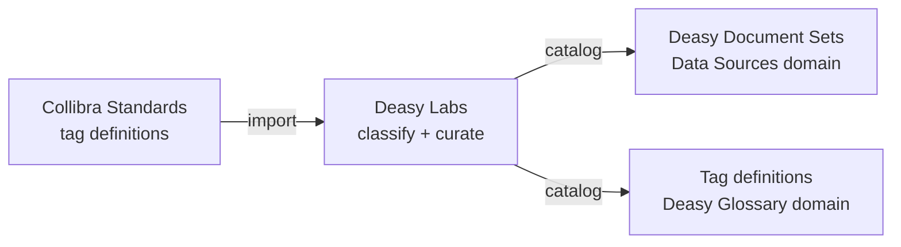

Deasy Labs integrates with the Collibra platform so unstructured data becomes part of your governed data landscape. Two asset types carry the integration: **Deasy Document Sets**, which catalog curated sets of documents defined by tag filters, and **Tag definitions**, which catalog the metadata vocabulary itself in the Deasy Glossary.

## Deasy Document Sets

A document set is a group of documents defined by a tag-filter condition, cataloged as a `Deasy Document Set` asset in Collibra's Data Sources domain. The asset carries profiling attributes computed from the underlying files and a deep link back to Deasy.

<Frame caption="A Deasy Document Set asset in Collibra, defined by the tag filter Author = Alex Lyons">
  
</Frame>

| Attribute | What it holds |
| :-- | :-- |
| **Tag Filters** | The defining condition, for example `"Author" = "Alex Lyons"` |
| **Document Types** | The extracted document types present in the set |
| **File Formats** | File formats present in the set |
| **Common Folders / File Locations** | Where the files live in the source system |
| **Earliest Creation Date** | Oldest document in the set |
| **Number of Files** | Set size |
| **URL** | "View files in Deasy", a deep link to the live set |

Document sets follow Collibra's asset lifecycle (for example `Candidate`), so governance teams review and approve them like any other asset.

## Tag Definitions in the Deasy Glossary

Every tag becomes a `Tag definition` asset in the Deasy Glossary domain, so the vocabulary used to classify unstructured data is itself governed. The asset carries the tag's full extraction instruction, its constraints, and its group (`OOB` for the platform's built-in tags).

<Frame caption="The built-in Primary Topic tag cataloged as a Tag definition asset in the Deasy Glossary">
  
</Frame>

| Attribute | What it holds |
| :-- | :-- |
| **Description** | The full extraction instruction the classifier uses |
| **Max Values** | How many values the tag may return |
| **Group** | The tag's group, `OOB` for built-in platform tags |

Tag definitions can also flow the other way: standards defined in Collibra import into Deasy as tags, carrying their Collibra identity (`collibra_asset_id`, `collibra_domain_id`) and governance metadata (record codes, retention periods, dispositions) with them. See [Taxonomies and Tags](/concepts/taxonomies-tags).

## How the Integration Works

<Steps>
  <Step title="Catalog the vocabulary">
    Tag definitions land in the Deasy Glossary domain, whether they originate in Deasy or import from Collibra standards.
  </Step>
  <Step title="Classify and curate in Deasy">
    Run classification and build the tag-filtered sets your use cases need. Every extraction carries values, evidence, and confidence.
  </Step>
  <Step title="Catalog the document sets">
    Curated sets publish to Collibra as Deasy Document Set assets with their profiling attributes and a live link back to the files in Deasy.
  </Step>
</Steps>

## Why It Matters

Unstructured documents are invisible to most governance programs. With document sets and tag definitions cataloged, governance teams see what document collections exist, how they are defined, and which vocabulary describes them, with the same lifecycle, responsibilities, and audit trail as any governed asset, and one click back to the live data in Deasy.

## Next Steps

<CardGroup cols={2}>
  <Card title="Integrations Overview" icon="grid" href="/integrations/overview">
    All sources, destinations, and file types in one place.
  </Card>
  <Card title="Taxonomies and Tags" icon="tags" href="/concepts/taxonomies-tags">
    Tag definitions, governance metadata, and strategies.
  </Card>
</CardGroup>
