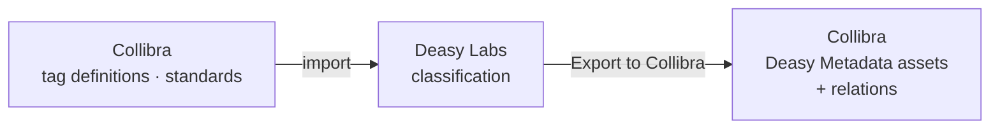

Deasy Labs integrates with the Collibra platform so the metadata you extract from unstructured documents becomes part of your governed data landscape. Tag definitions flow from Collibra into Deasy, classification runs in Deasy, and the enriched results publish back to Collibra as assets with relations.

## How the Integration Works

<Steps>
  <Step title="Import Tag Definitions">
    Governance teams define tags and standards in Collibra. Deasy imports them as tag definitions, so classification uses the vocabulary your organization already governs. Tags carry their Collibra identity (`collibra_asset_id`, `collibra_domain_id`) through the platform.
  </Step>
  <Step title="Classify in Deasy">
    Run classification against your document sources. Every extraction carries values, evidence, and confidence.
  </Step>
  <Step title="Export to Collibra">
    Publish the results to Collibra, creating Deasy Metadata assets linked to the source documents, tag definitions, and data sets they describe.
  </Step>
</Steps>

## What Lands in Collibra

| In Collibra | From Deasy |
| :-- | :-- |
| Deasy Metadata assets | Extracted tag values with evidence |
| Relations to documents and tag definitions | The lineage of every extraction |
| Document sets | Curated data slices |
| Retention and governance standards | Governance metadata on tags (record codes, retention periods, dispositions) |

<Note>
The Collibra export is configured in the app through a Collibra catalog profile. In the SDK, tags expose their Collibra linkage via the `collibra_asset_id` and `collibra_domain_id` fields on `tag_data`, and governance metadata (record code, retention period, disposition) travels with the tag. See [Taxonomies and Tags](/concepts/taxonomies-tags).
</Note>

## Why It Matters

Unstructured documents are invisible to most governance programs. With the integration, the metadata Deasy extracts gets the same treatment as any governed data: cataloged, related, and auditable. Retention standards defined in Collibra can drive rule-based tags in Deasy, and detection results flow back as evidence.

## Next Steps

<CardGroup cols={2}>
  <Card title="Databricks" icon="database" href="/integrations/databricks">
    Ship curated slices to Unity Catalog Volumes.
  </Card>
  <Card title="Taxonomies and Tags" icon="tags" href="/concepts/taxonomies-tags">
    Tag definitions, governance metadata, and strategies.
  </Card>
</CardGroup>
