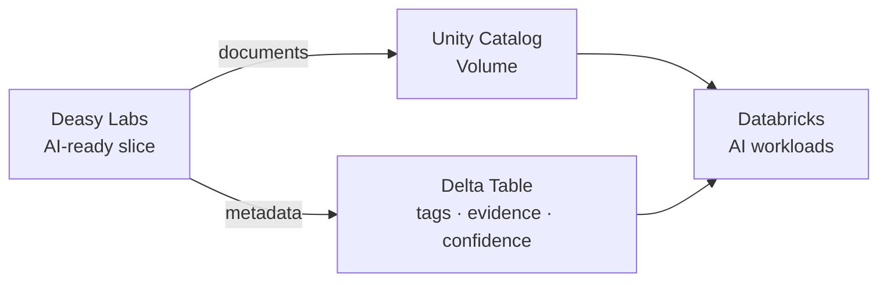

The Databricks integration delivers a curated data slice into a Unity Catalog Volume, with the extracted metadata alongside as a Delta table. Your lakehouse receives documents that passed the quality gate, ready for Databricks-native AI workloads, instead of a raw dump.

## How It Works

<Steps>
  <Step title="Curate the Slice">
    Build an AI-ready slice with the [readiness flow](/cookbooks/data-quality): quality tags present, expired and redundant files excluded, sensitivity gated if the use case requires it.
  </Step>
  <Step title="Configure the Databricks Destination">
    Set up the Unity Catalog Volume as an export destination in the app's Export Destinations tab.
  </Step>
  <Step title="Export">
    The slice's documents land in the Volume, and the metadata lands as a queryable Delta table next to them.
  </Step>
</Steps>

<Note>
The Databricks Volumes destination is configured through the app. The SDK's destination resource currently exposes SharePoint, OneDrive, PostgreSQL, Azure SQL, and S3 targets; see [Destinations](/concepts/destinations) for the SDK-managed export surface.
</Note>

## Why Slices, Not Sources

Only data that passes the gate reaches the destination. Exporting a curated slice means your lakehouse AI workloads never index expired policies, redundant copies, or restricted content, and the metadata table gives every downstream job the context of what each document is.

## Next Steps

<CardGroup cols={2}>
  <Card title="Prepare an AI-Ready Dataset" icon="filter" href="/cookbooks/data-quality">
    The readiness flow that produces what you ship.
  </Card>
  <Card title="Collibra" icon="building-columns" href="/integrations/collibra">
    Publish the same metadata into your governance catalog.
  </Card>
</CardGroup>
