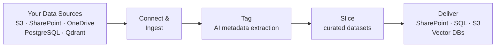

**Deasy Labs** delivers the right slice of your organization's knowledge, ready for AI in minutes. It turns unstructured data, from a sprawling SharePoint to decades of PDFs, into the exact dataset your team is building against. Connect your storage, tag thousands of files per minute with AI-extracted metadata, slice your data any way you want, and deliver AI-ready datasets to vector databases, SharePoint, SQL warehouses, and the Collibra platform.

## How It Works

<Steps>
  <Step title="Connect">
    Point a [Data Connector](/concepts/data-connectors) at your document store. No data migration needed.
  </Step>
  <Step title="Tag">
    Define what you want to know about your documents with [Tags and Taxonomies](/concepts/taxonomies-tags), or let AI suggest them. Classification generates [Metadata](/concepts/metadata) with values, evidence, and confidence for every document.
  </Step>
  <Step title="Slice">
    Build [Data Slices](/concepts/data-slices) that capture the exact subset each use case needs.
  </Step>
  <Step title="Deliver">
    Export slices to [Destinations](/concepts/destinations) and enrich documents at the source.
  </Step>
  <Step title="Maintain">
    Schedule [Workflows](/concepts/workflows) so datasets stay fresh as documents change.
  </Step>
</Steps>

## Start Building

<CardGroup cols={2}>
  <Card title="Quickstart" icon="rocket" href="/quickstart">
    Go from zero to extracted metadata in under 5 minutes with the Python SDK.
  </Card>
  <Card title="Platform Overview" icon="book" href="/concepts/overview">
    Understand the building blocks: connectors, tags, slices, and destinations.
  </Card>
  <Card title="Cookbooks" icon="utensils" href="/cookbooks/qdrant-to-qdrant">
    End-to-end recipes for RAG pipelines, PII detection, and data quality.
  </Card>
  <Card title="API Reference" icon="brackets-curly" href="/api-reference">
    Every endpoint, generated from the live OpenAPI specification.
  </Card>
</CardGroup>

## Why Teams Use It

<CardGroup cols={3}>
  <Card title="Better AI Results" icon="sparkles">
    Curate before you compute. Retrieval works on high-quality, relevant knowledge instead of raw document dumps.
  </Card>
  <Card title="Protect Sensitive Data" icon="shield-check">
    Detect PII, PHI, and PCI automatically at scale and route sensitive content before it reaches downstream systems.
  </Card>
  <Card title="Reliable Over Time" icon="clock">
    Scheduled workflows keep datasets fresh, so answers stay grounded in current documents.
  </Card>
</CardGroup>
