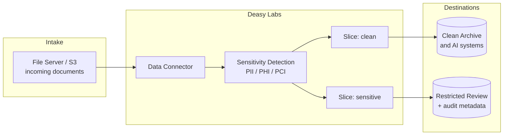

Sensitive content hides in every large document store. This use case detects PII, PHI, and PCI with the platform's built-in classifiers, routes flagged documents to a restricted review path with a full metadata audit trail, and guarantees that customer-facing AI systems only ever see the clean set.

## The System

## Key Decisions

| Decision | Recommendation |
| :-- | :-- |
| Detection | The platform's 40+ built-in sensitivity classifiers, plus Pattern tags for organization-specific identifiers |
| Rollups | Gate on the automatic `PII` / `PCI` / `PHI` rule tags rather than individual detections |
| Routing | Two Data Slices: clean (`not_exists` on the rollup tags) and sensitive (the inverse) |
| Audit | Export with `metadata_format="column_store"` so auditors can query flags directly |
| Scope | Enable Sensitive Data Detection per [Project](/concepts/projects); sensitivity is an opt-in gate per use case |

## Build It

<CardGroup cols={2}>
  <Card title="Protect Sensitive Data" icon="shield" href="/cookbooks/pii-detection">
    Built-in classifiers, rollup tags, and the gated slice.
  </Card>
  <Card title="Collibra" icon="building-columns" href="/integrations/collibra">
    Catalog the document sets and tag definitions for governance.
  </Card>
</CardGroup>
