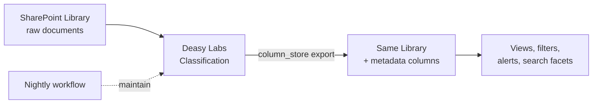

Not every consumer of metadata is an AI system. This use case keeps documents where they live and writes extracted metadata back as native columns, so SharePoint users get filterable, sortable, searchable libraries without changing how they work.

## The System

## Key Decisions

| Decision | Recommendation |
| :-- | :-- |
| Export format | `column_store`, one native SharePoint column per tag |
| Tag design | Few, high-value columns people will actually filter by (type, dates, value, owner) |
| Maintenance | A nightly ingest-then-classify [Workflow](/concepts/workflows) keeps columns current |
| Scope | Enrich at the source: the destination is the same library the documents came from |

## Build It

<CardGroup cols={2}>
  <Card title="Organize a SharePoint Library" icon="microsoft" href="/cookbooks/sharepoint-to-sharepoint">
    Connect, classify, write columns back, and schedule maintenance.
  </Card>
  <Card title="Bootstrap a Taxonomy with AI" icon="tags" href="/cookbooks/custom-taxonomy">
    Let AI design the columns from your actual documents.
  </Card>
</CardGroup>
