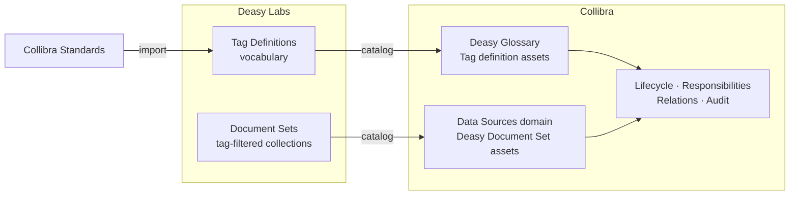

Most governance programs stop at structured data; the file shares and libraries where the riskiest content lives stay invisible. This use case catalogs what exists: curated document sets appear in Collibra with profiling attributes and lifecycle status, and the tag vocabulary that describes them is governed in the Deasy Glossary.

## The System

## Key Decisions

| Decision | Recommendation |
| :-- | :-- |
| What to catalog | Document sets that matter to a use case, not every ad hoc filter |
| Vocabulary | Import retention and classification standards from Collibra so tags carry governed definitions |
| Lifecycle | Let document sets flow through Collibra's asset statuses (for example `Candidate`) for review and approval |
| Traceability | Every Document Set asset keeps its "View files in Deasy" deep link, so review is one click from the live data |
| Sensitivity | Combine with [sensitivity detection](/use-cases/compliance) so flagged content is visible to governance |

## Build It

<CardGroup cols={2}>
  <Card title="Collibra Integration" icon="building-columns" href="/integrations/collibra">
    Document sets and tag definitions, cataloged with attributes and relations.
  </Card>
  <Card title="Taxonomies and Tags" icon="tags" href="/concepts/taxonomies-tags">
    Governance metadata on tags: record codes, retention, dispositions.
  </Card>
  <Card title="Prepare an AI-Ready Dataset" icon="filter" href="/cookbooks/data-quality">
    Produce the curated sets worth cataloging.
  </Card>
  <Card title="Protect Sensitive Data" icon="shield" href="/cookbooks/pii-detection">
    The detection signals governance reviews.
  </Card>
</CardGroup>
