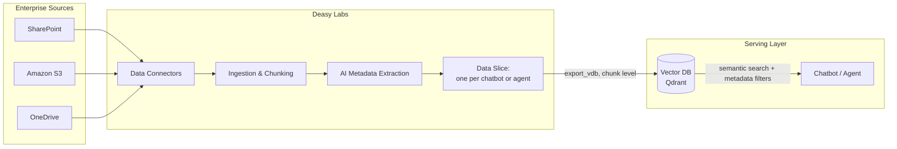

A chatbot or agent is only as good as the knowledge it retrieves from. This use case turns enterprise sources into a curated serving collection: metadata-rich chunks, contamination removed, scoped per application. Metadata filters cut retrieval noise so the LLM only sees chunks from the right documents.

## The System

## Key Decisions

| Decision | Recommendation |
| :-- | :-- |
| Export level | `chunk`, one vector record per text segment |
| Scoping | One Data Slice per chatbot or agent; export the slice, not the whole connector |
| Metadata | Extract classification tags (document type, department, date) to power retrieval filters |
| Quality gate | Exclude anything carrying a `Data Quality Status` flag so stale drafts and duplicates never reach the index |
| Freshness | Apply a freshness rule per use case and refresh on a schedule |

## Build It

<CardGroup cols={2}>
  <Card title="Clean Up a RAG Index" icon="database" href="/cookbooks/qdrant-to-qdrant">
    Enrich an existing collection and serve a curated one, maintained nightly.
  </Card>
  <Card title="Scope Chatbot Answers with Metadata" icon="comments" href="/cookbooks/metadata-filtered-rag">
    Turn extracted tags into retrieval filters.
  </Card>
  <Card title="Prepare an AI-Ready Dataset" icon="filter" href="/cookbooks/data-quality">
    The readiness flow that produces what you index.
  </Card>
  <Card title="Keep Answers Current Over Time" icon="clock" href="/cookbooks/freshness-curation">
    Expired content drops out of the serving set automatically.
  </Card>
</CardGroup>
