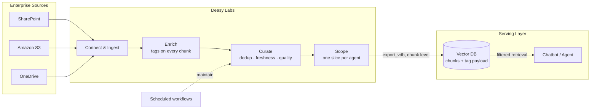

Every RAG pipeline and agent has the same dependency: the knowledge it retrieves from. Point one at a raw document dump and it fails in predictable ways. Duplicates crowd out diverse results in the top-k. A 2019 policy draft contradicts the current one and the agent can't tell which to trust. Semantic similarity surfaces chunks that sound right but come from the wrong document entirely. And a customer-facing agent retrieves from the same pool as an internal legal tool, because nothing scopes what each application is allowed to know.

Embeddings alone cannot fix any of this, because none of these are similarity problems. They are context problems: the pipeline does not know what each document *is*, whether it is current, whether it is a copy, or who should see it. That knowledge is metadata, and producing it is what Deasy Labs does: it makes the document set AI-ready for this use case.

## What AI-Ready Knowledge Looks Like

| Layer | Raw document dump | With Deasy Labs |
| :-- | :-- | :-- |
| **Curation** | Everything is indexed, including drafts, copies, and expired content | Duplicates and superseded versions flagged and excluded; only documents that pass the gate are indexed |
| **Enrichment** | A chunk is anonymous text | Every chunk carries its document's tags: type, author, date, department, governing law |
| **Scoping** | One pool for every application | One slice per chatbot or agent, with its own relevance rules and sensitivity gate |
| **Retrieval** | Similarity only | Metadata narrows the candidate pool first, then similarity ranks within it |
| **Answers** | Ungrounded text | Provenance per chunk; extraction evidence and confidence are auditable |
| **Over time** | The index rots as documents change | Freshness rules, version detection, and scheduled workflows keep the serving set current |

Curation alone is worth the effort before anything else: in internal benchmarks, indexing only the latest version of each document improved retrieval accuracy by 46% relative to indexing everything.

## The System

## How Each Layer Pays Off

**Curation cuts contamination.** The platform's duplicate detection collapses copy clusters to one canonical document, version detection finds superseded revisions, and your freshness rule expires out-of-date content. What reaches the index is one current copy of each logical document. The agent stops hedging between three versions of the same policy.

**Enrichment turns chunks into context.** Tags travel with every exported chunk as payload. That gives retrieval something similarity cannot see (the difference between an executed contract and its unsigned draft), gives the LLM provenance to cite, and gives you the smallest set of high-signal tokens instead of stuffing whole documents into the prompt.

**Scoping makes knowledge per-application.** A slice is a use case. The support chatbot's slice contains current manuals and FAQs with the sensitivity gate on; the sales agent's slice contains contracts and pricing; the same document can be in one and excluded from the other. Access decisions become slice conditions, not prompt instructions.

**Filtered retrieval multiplies precision.** With tags in the payload, a question like "what are the termination terms in our supplier agreements" filters to supplier agreements first, then ranks by similarity within that pool. The candidate set shrinks from the whole corpus to exactly the right documents before the LLM sees a token.

**Maintenance keeps answers reliable.** Scheduled workflows re-classify new content, freshness rules expire aging content, and the serving slice re-exports, so accuracy does not decay as the source evolves.

## Key Decisions

| Decision | Recommendation |
| :-- | :-- |
| Export level | `chunk`, one vector record per text segment, tags as payload |
| Scoping | One Data Slice per chatbot or agent; export the slice, not the connector |
| Tag design | Extract the tags users scope questions by: document type, department, dates, jurisdiction |
| Quality gate | Exclude anything carrying a `Data Quality Status` flag |
| Sensitivity | Gate customer-facing slices on the `PII` / `PCI` / `PHI` rollup tags |
| Maintenance | Nightly classify plus re-export workflow per serving slice |

## Build It

<CardGroup cols={2}>
  <Card title="Clean Up a RAG Index" icon="database" href="/cookbooks/qdrant-to-qdrant">
    Enrich an existing collection and serve a curated one, maintained nightly.
  </Card>
  <Card title="Scope Chatbot Answers with Metadata" icon="comments" href="/cookbooks/metadata-filtered-rag">
    The filtered-retrieval side, end to end.
  </Card>
  <Card title="Prepare an AI-Ready Dataset" icon="filter" href="/cookbooks/data-quality">
    The curation gate that decides what gets indexed.
  </Card>
  <Card title="Keep Answers Current Over Time" icon="clock" href="/cookbooks/freshness-curation">
    Freshness rules and version grouping for the serving set.
  </Card>
</CardGroup>
